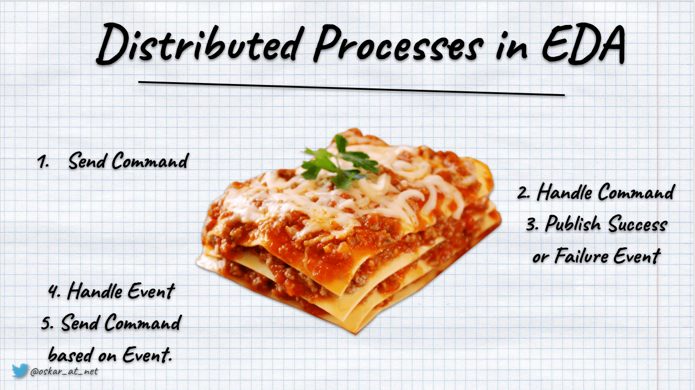

[](https://twitter.com/oskar_at_net) [](https://github.com/sponsors/oskardudycz/)   [](https://event-driven.io/?utm_source=event_sourcing_jvm) [](https://www.architecture-weekly.com/?utm_source=event_sourcing_jvm) 

# Distributed process with Event Sourcing

- [Distributed process with Event Sourcing](#distributed-process-with-event-sourcing)
  - [Batch operations](#batch-operations)
  - [Cross-module processes with compensation](#cross-module-processes-with-compensation)

Those samples present how you can tackle handling distributed processes in Event Sourcing. For more background, check my article [Saga and Process Manager - distributed processes in practice](https://event-driven.io/en/saga_process_manager_distributed_transactions?utm_source=event_sourcing_jvm). 

Distributed processes with an event-driven approach embrace the impossibility of the two-phase commit in distributed transactions. Instead of trying to make a big transaction across modules and databases, it does a sequence of _microtransactions_. Each operation is handled by the module that's the source of truth and can make autonomous decisions. The distributed process is triggered by the event registered and published in the system, e.g. shopping cart confirmed. Then another module can subscribe to it and take it from there. It knows what should be the next operation, e.g. initiating the order process. It sends a command that is handled, and business logic creates another event. This event is the trigger for the next step of the workflow. Such _lasagne_ of event/command/event/command continues until the process is finished (with success or failure).



## Batch operations

A common example of the distributed process is handling batch operations—for instance, group guests checkout in the hotel. So someone selects the set of guest accounts and clicks "check out". After that, the process tries to check out all of them. If the whole process fails, there's no compensation, but you could rerun the checkout after resolving the issues.

The Group checkout saga can look as:

```java
public class GroupCheckoutSaga {
  private final CommandBus commandBus;

  public GroupCheckoutSaga(CommandBus commandBus) {
    this.commandBus = commandBus;
  }

  public void on(GroupCheckoutInitiated groupCheckoutInitiated) {
    for (var guestAccountId : groupCheckoutInitiated.guestStayAccountIds()) {
      commandBus.send(
        new CheckoutGuestAccount(guestAccountId, groupCheckoutInitiated.groupCheckoutId())
      );
    }
    commandBus.send(
      new RecordGuestStayInitiation(groupCheckoutInitiated.groupCheckoutId(), groupCheckoutInitiated.guestStayAccountIds())
    );
  }

  public void on(GuestStayAccountEvent.GuestAccountCheckoutCompleted guestCheckoutCompleted) {
    if (guestCheckoutCompleted.groupCheckoutId() == null)
      return;

    commandBus.send(
      new RecordGuestCheckoutCompletion(
        guestCheckoutCompleted.groupCheckoutId(),
        guestCheckoutCompleted.guestStayAccountId(),
        guestCheckoutCompleted.completedAt()
      )
    );
  }

  public void on(GuestStayAccountEvent.GuestAccountCheckoutFailed guestCheckoutFailed) {
    if (guestCheckoutFailed.groupCheckoutId() == null)
      return;

    commandBus.send(
      new RecordGuestCheckoutFailure(
        guestCheckoutFailed.groupCheckoutId(),
        guestCheckoutFailed.guestStayAccountId(),
        guestCheckoutFailed.failedAt()
      )
    );
  }
}
```

See more in [GroupCheckoutSaga.java](./src/main/java/io/eventdriven/distributedprocesses/hotelmanagement/groupcheckout/GroupCheckoutSaga.java)

Saga, sens commands through command bus, storing commands durable and using outbox pattern to ensure that they're delivered. The example command bus using ESDB and its subscriptions can look like this:

```java
public class ESDBCommandBus implements CommandBus {
  private static final String commandStreamId = "_commands-all";
  private final EventStoreDBClient eventStoreDBClient;
  private final EventStore eventStore;
  private final RetryPolicy retryPolicy;
  private final Supplier<String> currentCorrelationId;
  private final Supplier<String> currentCausationId;

  public ESDBCommandBus(
    EventStoreDBClient eventStoreDBClient,
    EventStore eventStore,
    RetryPolicy retryPolicy,
    Supplier<String> currentCorrelationId,
    Supplier<String> currentCausationId
  ) {
    this.eventStoreDBClient = eventStoreDBClient;
    this.eventStore = eventStore;
    this.retryPolicy = retryPolicy;
    this.currentCorrelationId = currentCorrelationId;
    this.currentCausationId = currentCausationId;
  }

  @Override
  public <Command> EventStore.AppendResult send(Command command) {
    return retryPolicy.run(ack -> {
      var result = eventStore.append(
        commandStreamId,
        new CommandEnvelope<>(command, new CommandMetadata(currentCorrelationId.get(), currentCausationId.get()))
      );

      if (!(result instanceof EventStore.AppendResult.UnexpectedFailure))
        ack.accept(result);
    });
  }

  @Override
  public void subscribe(Consumer<CommandEnvelope<Object>>... handlers) {
    subscribeToStream(eventStoreDBClient, commandStreamId, (subscription, resolvedEvent) -> {
      var commandEnvelope = deserializeCommand(resolvedEvent);

      if (commandEnvelope.isEmpty()) {
        return;
      }

      for (var handler : handlers) {
        handler.accept(commandEnvelope.get());
      }
    });
  }
}
```

See more in [ESDBCommandBus.java](./src/main/java/io/eventdriven/distributedprocesses/core/commands/ESDBCommandBus.java)

The business logic of the saga processing is delegated to aggregate. Thanks to that, we have a clear split of responsibility between coordination (saga) and business logic (aggregate). Thanks to that, the saga is lightweight and much easier to maintain than merging both into Process Manager.

See the in [GroupCheckout](./src/main/java/io/eventdriven/distributedprocesses/hotelmanagement/groupcheckout/GroupCheckout.java) aggregate.

We can check out the guest account if the balance is settled. If it's not, then it will store the failure event: 

```java
public void checkout(@Nullable UUID groupCheckoutId, OffsetDateTime now) {
  if (status != Status.Open || balance != 0) {
    enqueue(new GuestAccountCheckoutFailed(id(), groupCheckoutId, OffsetDateTime.now()));
  }
  enqueue(new GuestAccountCheckoutCompleted(id(), groupCheckoutId, now));
}
```

See more in [GuestStayAccount](https://github.com/oskardudycz/EventSourcing.JVM/blob/distributed_processes/samples/distributed-processes/src/main/java/io/eventdriven/distributedprocesses/hotelmanagement/gueststayaccount/GuestStayAccount.java#L48) aggregate.

We should use a retry policy in the command handler/application service to ensure that we won't fail because of random transient errors.

```java
public ETag handle(CheckoutGuestAccount command) {
    return retryPolicy.run(ack -> {
      var result = store.getAndUpdate(
        current -> current.checkout(
          command.guestStayAccountId(),
          OffsetDateTime.now()
        ),
        command.guestStayAccountId()
      );
      ack.accept(result);
    });
  }
```

See more in [GuestStayAccountService](./src/main/java/io/eventdriven/distributedprocesses/hotelmanagement/gueststayaccount/GuestStayAccountService.java#L60)

As an alternative to the retry policy, we could do a [Pokémon exception handling](https://www.dodgycoder.net/2011/11/yoda-conditions-pokemon-exception.html) in the command handler and then publish the failure event.

## Cross-module processes with compensation

The previous example didn't have a clear split between the internal and external events, as all of the processing was bounded in the same module. We didn't need to map the internal terminology to the external world.

We need to be careful when we're doing cross-module coordination. E.g. Order Saga is initiated by the Shopping Cart module; then, it needs to initiate payment in shipment, which are handled by dedicated modules. If we exposed all the internal events outside, we would get the leaking abstractions. I wrote about that longer in [Events should be as small as possible, right?](https://event-driven.io/en/events_should_be_as_small_as_possible?utm_source=event_sourcing_jvm). We need to set the clear split between internal and external events and then map one into another.

While doing that, we could do enrichment, as the external event can be less granular, as they should be understandable in the scope of the whole system (e.g. close to the result of _big picture_ Event Storming session). Example enrichment can look like this:

```java
public class ShoppingCartExternalEventForwarder {
  private final AggregateStore<ShoppingCart, ShoppingCartEvent, UUID> store;
  private final EventBus eventBus;

  public ShoppingCartExternalEventForwarder(
    AggregateStore<ShoppingCart, ShoppingCartEvent, UUID> store,
    EventBus eventBus
  ) {
    this.store = store;
    this.eventBus = eventBus;
  }

  public void on(ShoppingCartConfirmed event) {
    var cart = store.get(event.shoppingCartId())
      .orElseThrow(() -> new IllegalStateException("Cannot enrich event, as shopping cart with id '%s' was not found".formatted(event.shoppingCartId())));

    var externalEvent = new ShoppingCartFinalized(
      event.shoppingCartId(),
      cart.clientId(),
      cart.productItems(),
      cart.totalPrice(),
      event.confirmedAt()
    );

    eventBus.publish(externalEvent);
  }
}
```

See more in [ShoppingCartExternalEventForwarder.java](.src\main\java\io\eventdriven\distributedprocesses\ecommerce\shoppingcarts\external\ShoppingCartExternalEventForwarder.java).

Such events can be handled by the saga located in some modules. For instance:

```java
public class OrderSaga {
  private final CommandBus commandBus;

  public OrderSaga(CommandBus commandBus) {
    this.commandBus = commandBus;
  }

  // Happy path
  public void on(ShoppingCartFinalized event) {
    commandBus.send(
      new OrderCommand.InitializeOrder(
        event.cartId(),
        event.clientId(),
        event.productItems(),
        event.totalPrice()
      )
    );
  }

  public void on(OrderInitialized event) {
    commandBus.send(
      new PaymentCommand.RequestPayment(
        UUID.randomUUID(),
        event.orderId(), event.totalPrice()
      )
    );
  }

  public void on(PaymentExternalEvent.PaymentFinalized event) {
    commandBus.send(
      new RecordOrderPayment(
        event.orderId(),
        event.paymentId(),
        event.finalizedAt()
      )
    );
  }

  public void on(OrderPaymentRecorded event) {
    commandBus.send(
      new ShipmentCommand.SendPackage(
        event.orderId(),
        Arrays.stream(event.productItems())
          .map(pi -> new ProductItem(pi.productId(), pi.quantity()))
          .toArray(ProductItem[]::new)
      )
    );
  }

  public void on(ShipmentEvent.PackageWasSent event) {
    commandBus.send(
      new CompleteOrder(
        event.orderId()
      )
    );
  }

  // Compensation
  public void on(ShipmentEvent.ProductWasOutOfStock event) {
    commandBus.send(
      new CancelOrder(
        event.orderId(),
        OrderCancellationReason.ProductWasOutOfStock
      )
    );
  }

  public void on(OrderCancelled event) {
    if (event.paymentId() == null) {
      return;
    }
    commandBus.send(
      new PaymentCommand.DiscardPayment(
        event.paymentId(),
        DiscardReason.OrderCancelled
      )
    );
  }
}
```

If you look closer, you may notice that we're also handling the negative scenarios. If the product was out of stock, we're sending a command to cancel the order. Cancelling an order should trigger discarding payment (as we should return the money to the client if we can't complete the order). This process is called compensation. Read more about its importance in [What texting your Ex has to do with Event-Driven Design?](https://event-driven.io/en/what_texting_ex_has_to_do_with_event_driven_design?utm_source=event_sourcing_jvm).

Each module:
- [shopping carts](./src/main/java/io/eventdriven/distributedprocesses/ecommerce/shoppingcarts/),
- [orders](./src/main/java/io/eventdriven/distributedprocesses/ecommerce/orders/),
- [payments](./src/main/java/io/eventdriven/distributedprocesses/ecommerce/payments/),
- [shipments](./src/main/java/io/eventdriven/distributedprocesses/ecommerce/shipments/).

can use dedicated event store streams to publish their external events, e.g. _'shopping_carts__external-events'_. Other modules can subscribe to those streams and take it from there. It is a similar concept to Kafka's topics.
