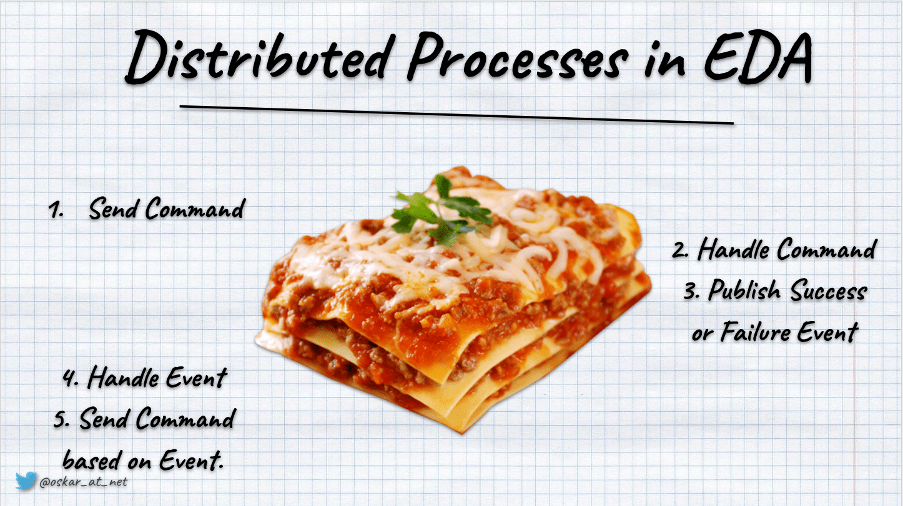
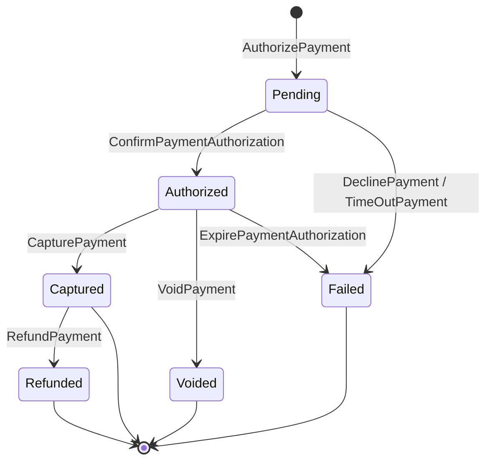
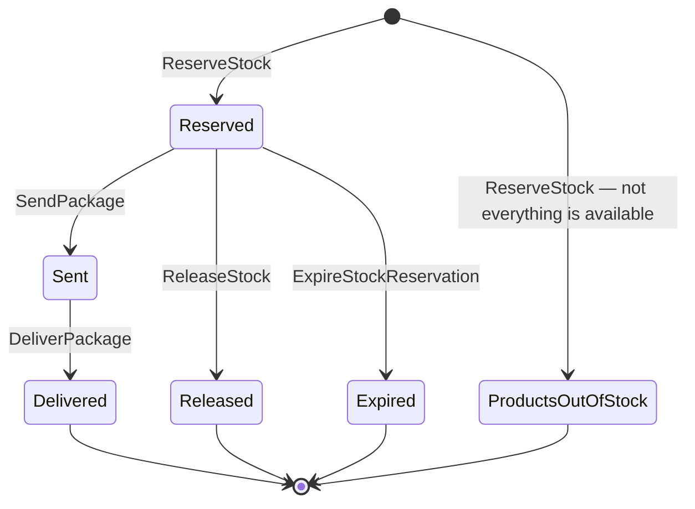
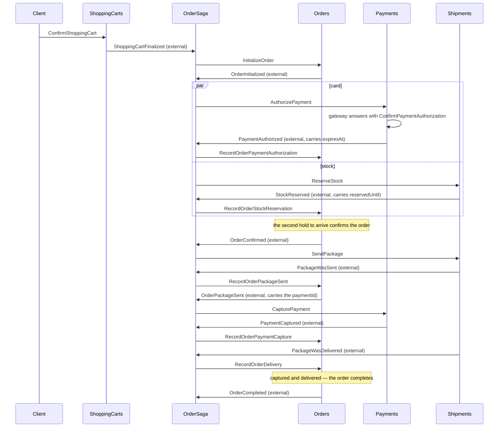
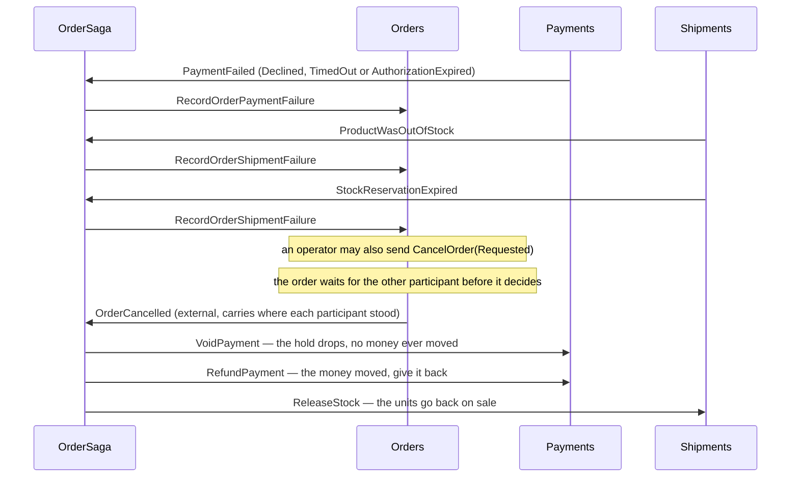

[](https://twitter.com/oskar_at_net) [](https://github.com/sponsors/oskardudycz/) [](https://event-driven.io/?utm_source=event_sourcing_jvm) [](https://www.architecture-weekly.com/?utm_source=event_sourcing_jvm) 

 

# Distributed process with Event Sourcing

- [Distributed process with Event Sourcing](#distributed-process-with-event-sourcing)
  - [Batch operations](#batch-operations)
  - [Cross-module processes with compensation](#cross-module-processes-with-compensation)
    - [Two holds, then two commits](#two-holds-then-two-commits)
    - [Where this flow comes from](#where-this-flow-comes-from)
    - [Compensation](#compensation)
    - [The order decides, the saga only translates](#the-order-decides-the-saga-only-translates)
    - [Why the saga stays stateless](#why-the-saga-stays-stateless)
    - [Internal events and the published contract](#internal-events-and-the-published-contract)
    - [Appending is publishing](#appending-is-publishing)
    - [The two settlement seams](#the-two-settlement-seams)
    - [When things go wrong](#when-things-go-wrong)
    - [What this sample deliberately does not do](#what-this-sample-deliberately-does-not-do)

Those samples present how you can tackle handling distributed processes in Event Sourcing. For more background, check my articles [Saga and Process Manager - distributed processes in practice](https://event-driven.io/en/saga_process_manager_distributed_transactions?utm_source=event_sourcing_jvm) and [No, it can never happen!](https://event-driven.io/en/no_it_can_never_happen/?utm_source=event_sourcing_jvm). 

Distributed processes with an event-driven approach embrace the impossibility of the two-phase commit in distributed transactions. Instead of trying to make a big transaction across modules and databases, it does a sequence of _microtransactions_. Each operation is handled by the module that's the source of truth and can make autonomous decisions. The distributed process is triggered by the event registered and published in the system, e.g. shopping cart confirmed. Then another module can subscribe to it and take it from there. It knows what should be the next operation, e.g. initiating the order process. It sends a command that is handled, and business logic creates another event. This event is the trigger for the next step of the workflow. Such _lasagne_ of event/command/event/command continues until the process is finished (with success or failure).



## Batch operations

A common example of the distributed process is handling batch operations—for instance, group guests checkout in the hotel. So someone selects the set of guest accounts and clicks "check out". After that, the process tries to check out all of them. If the whole process fails, there's no compensation, but you could rerun the checkout after resolving the issues.

The Group checkout saga can look as:

```java
public class GroupCheckoutSaga {
  private final CommandBus commandBus;

  public GroupCheckoutSaga(CommandBus commandBus) {
    this.commandBus = commandBus;
  }

  public void on(GroupCheckoutInitiated groupCheckoutInitiated) {
    for (var guestAccountId : groupCheckoutInitiated.guestStayAccountIds()) {
      commandBus.send(
        new CheckoutGuestAccount(guestAccountId, groupCheckoutInitiated.groupCheckoutId())
      );
    }
    commandBus.send(
      new RecordGuestStayInitiation(groupCheckoutInitiated.groupCheckoutId(), groupCheckoutInitiated.guestStayAccountIds())
    );
  }

  public void on(GuestStayAccountEvent.GuestAccountCheckoutCompleted guestCheckoutCompleted) {
    if (guestCheckoutCompleted.groupCheckoutId() == null)
      return;

    commandBus.send(
      new RecordGuestCheckoutCompletion(
        guestCheckoutCompleted.groupCheckoutId(),
        guestCheckoutCompleted.guestStayAccountId(),
        guestCheckoutCompleted.completedAt()
      )
    );
  }

  public void on(GuestStayAccountEvent.GuestAccountCheckoutFailed guestCheckoutFailed) {
    if (guestCheckoutFailed.groupCheckoutId() == null)
      return;

    commandBus.send(
      new RecordGuestCheckoutFailure(
        guestCheckoutFailed.groupCheckoutId(),
        guestCheckoutFailed.guestStayAccountId(),
        guestCheckoutFailed.failedAt()
      )
    );
  }
}
```

See more in [GroupCheckoutSaga.java](./src/main/java/io/eventdriven/distributedprocesses/hotelmanagement/saga/groupcheckout/GroupCheckoutSaga.java)

Saga, sens commands through command bus, storing commands durable and using outbox pattern to ensure that they're delivered. The example command bus using ESDB and its subscriptions can look like this:

```java
public class ESDBCommandBus implements CommandBus {
  private static final String commandStreamId = "_commands-all";
  private final EventStoreDBClient eventStoreDBClient;
  private final EventStore eventStore;
  private final RetryPolicy retryPolicy;
  private final Supplier<String> currentCorrelationId;
  private final Supplier<String> currentCausationId;

  public ESDBCommandBus(
    EventStoreDBClient eventStoreDBClient,
    EventStore eventStore,
    RetryPolicy retryPolicy,
    Supplier<String> currentCorrelationId,
    Supplier<String> currentCausationId
  ) {
    this.eventStoreDBClient = eventStoreDBClient;
    this.eventStore = eventStore;
    this.retryPolicy = retryPolicy;
    this.currentCorrelationId = currentCorrelationId;
    this.currentCausationId = currentCausationId;
  }

  @Override
  public <Command> EventStore.AppendResult send(Command command) {
    return retryPolicy.run(ack -> {
      var result = eventStore.append(
        commandStreamId,
        new CommandEnvelope<>(command, new CommandMetadata(currentCorrelationId.get(), currentCausationId.get()))
      );

      if (!(result instanceof EventStore.AppendResult.UnexpectedFailure))
        ack.accept(result);
    });
  }

  @Override
  public void subscribe(Consumer<CommandEnvelope<Object>>... handlers) {
    subscribeToStream(eventStoreDBClient, commandStreamId, (subscription, resolvedEvent) -> {
      var commandEnvelope = deserializeCommand(resolvedEvent);

      if (commandEnvelope.isEmpty()) {
        return;
      }

      for (var handler : handlers) {
        handler.accept(commandEnvelope.get());
      }
    });
  }
}
```

See more in [ESDBCommandBus.java](./src/main/java/io/eventdriven/distributedprocesses/core/commands/ESDBCommandBus.java)

The business logic of the saga processing is delegated to aggregate. Thanks to that, we have a clear split of responsibility between coordination (saga) and business logic (aggregate). Thanks to that, the saga is lightweight and much easier to maintain than merging both into Process Manager.

See the in [GroupCheckout](./src/main/java/io/eventdriven/distributedprocesses/hotelmanagement/saga/groupcheckout/GroupCheckout.java) aggregate.

We can check out the guest account if the balance is settled. If it's not, then it will store the failure event: 

```java
public void checkout(@Nullable UUID groupCheckoutId, OffsetDateTime now) {
  if (status != Status.Open || balance != 0) {
    enqueue(new GuestAccountCheckoutFailed(id(), groupCheckoutId, OffsetDateTime.now()));
  }
  enqueue(new GuestAccountCheckoutCompleted(id(), groupCheckoutId, now));
}
```

See more in [GuestStayAccount](https://github.com/oskardudycz/EventSourcing.JVM/blob/distributed_processes/samples/distributed-processes/src/main/java/io/eventdriven/distributedprocesses/hotelmanagement/gueststayaccount/GuestStayAccount.java#L48) aggregate.

We should use a retry policy in the command handler/application service to ensure that we won't fail because of random transient errors.

```java
public ETag handle(CheckoutGuestAccount command) {
    return retryPolicy.run(ack -> {
      var result = store.getAndUpdate(
        current -> current.checkout(
          command.guestStayAccountId(),
          OffsetDateTime.now()
        ),
        command.guestStayAccountId()
      );
      ack.accept(result);
    });
  }
```

See more in [GuestStayAccountService](./src/main/java/io/eventdriven/distributedprocesses/hotelmanagement/saga/gueststayaccount/GuestStayAccountService.java#L60)

As an alternative to the retry policy, we could do a [Pokémon exception handling](https://www.dodgycoder.net/2011/11/yoda-conditions-pokemon-exception.html) in the command handler and then publish the failure event.

## Cross-module processes with compensation

The batch example kept everything in one module, so it never had to separate what it says to itself
from what it says to the rest of the system. A cross-module process must.

The ecommerce sample runs one order across four modules — [shopping carts](./src/main/java/io/eventdriven/distributedprocesses/ecommerce/shoppingcarts/),
[orders](./src/main/java/io/eventdriven/distributedprocesses/ecommerce/orders/),
[payments](./src/main/java/io/eventdriven/distributedprocesses/ecommerce/payments/) and
[shipments](./src/main/java/io/eventdriven/distributedprocesses/ecommerce/shipments/) — and nothing
in it is bought in a single step.

### Two holds, then two commits

Real shops do not take the money and then hope the warehouse agrees. They take two **reversible
holds**, and commit both only when both are good:

```
authorise the card  ──┐
                      ├──> both holds good ──> pick, pack, send ──> capture the funds
reserve the stock   ──┘
```

An authorisation expires by itself. Stripe puts it plainly: an online card authorisation is
"usually valid for 7 days", and if it expires before you capture, "the funds are released and the
payment status changes to `canceled`". A stock reservation is the same idea in the warehouse:
Shopify calls the state **committed**, "units that are set aside and can't be sold, such as units in
an unfulfilled order".

That shape is what lets the sample answer the question the naive version could not: *what happens
when the payment fails after the goods were prepared?* Nothing has shipped, because nothing ships
before both holds are good. The compensation is to release a reservation, and that costs nothing.

### Where this flow comes from

The sample is not inventing vocabulary. Each command is named after the operation a real provider
exposes, and each state is one a real provider has.

**The card.** A payment service separates *authorising* — checking the funds are there and putting a
hold on them — from *capturing*, which is when the money actually moves. Stripe calls the split
[place a hold on a payment method](https://docs.stripe.com/payments/place-a-hold-on-a-payment-method)
and switches it on with `capture_method: manual`; Adyen calls the second half
[capture](https://docs.adyen.com/online-payments/capture) and supports delaying it. Both let you
drop the hold before any money moved, which is the operation this sample calls `VoidPayment`.


```mermaid
stateDiagram-v2
    [*] --> Pending: AuthorizePayment
    Pending --> Authorized: ConfirmPaymentAuthorization
    Pending --> Failed: DeclinePayment / TimeOutPayment
    Authorized --> Captured: CapturePayment
    Authorized --> Voided: VoidPayment
    Authorized --> Failed: ExpirePaymentAuthorization
    Captured --> Refunded: RefundPayment
    Captured --> [*]
    Voided --> [*]
    Refunded --> [*]
    Failed --> [*]
```

| Ours | Stripe | Adyen |
|---|---|---|
| `AuthorizePayment` | create a PaymentIntent with `capture_method: manual` | authorise |
| `CapturePayment` | capture the PaymentIntent | capture |
| `VoidPayment` | cancel the PaymentIntent | cancel |
| `RefundPayment` | refund the charge | refund |
| `ExpirePaymentAuthorization` | the authorisation lapses and the funds are released | the transaction expires |

How long the hold lasts is not one number. Stripe lists about 7 days for the common card-not-present
case. [Adyen's per-scheme table](https://docs.adyen.com/online-payments/adjust-authorisation) shows
how wide the range really is — Mastercard 7 days for a final authorisation and 30 for a
pre-authorisation, Visa 5 to 30 depending on the merchant category, JCB up to a year. That is why
`expiresAt` is carried **on the event** rather than assumed by the reader: the module records the
deadline it was actually granted.

**The stock.** The warehouse side is the same idea with different words. Shopify's
[inventory states](https://help.shopify.com/en/manual/products/inventory/managing-inventory-quantities/inventory-states)
separate *available* from *committed*, where committed units "can't be sold"; a warehouse management
system calls the step *allocation*, and a reservation that nobody acts on has to lapse so the units
go back on sale.


```mermaid
stateDiagram-v2
    [*] --> Reserved: ReserveStock
    [*] --> ProductsOutOfStock: ReserveStock — not everything is available
    Reserved --> Sent: SendPackage
    Reserved --> Released: ReleaseStock
    Reserved --> Expired: ExpireStockReservation
    Sent --> Delivered: DeliverPackage
    Delivered --> [*]
    Released --> [*]
    Expired --> [*]
    ProductsOutOfStock --> [*]
```

Both diagrams have the same shape, and that is the point: **a hold, a commit, and two ways to let
go.** The order sits on top of both and does nothing until each side has answered.


```mermaid
sequenceDiagram
    participant Client
    participant Cart as ShoppingCarts
    participant Saga as OrderSaga
    participant Order as Orders
    participant Pay as Payments
    participant Ship as Shipments

    Client->>Cart: ConfirmShoppingCart
    Cart->>Saga: ShoppingCartFinalized (external)
    Saga->>Order: InitializeOrder
    Order->>Saga: OrderInitialized (external)

    par card
        Saga->>Pay: AuthorizePayment
        Pay->>Pay: gateway answers with ConfirmPaymentAuthorization
        Pay->>Saga: PaymentAuthorized (external, carries expiresAt)
        Saga->>Order: RecordOrderPaymentAuthorization
    and stock
        Saga->>Ship: ReserveStock
        Ship->>Saga: StockReserved (external, carries reservedUntil)
        Saga->>Order: RecordOrderStockReservation
    end

    Note over Order: the second hold to arrive confirms the order
    Order->>Saga: OrderConfirmed (external)

    Saga->>Ship: SendPackage
    Ship->>Saga: PackageWasSent (external)
    Saga->>Order: RecordOrderPackageSent
    Order->>Saga: OrderPackageSent (external, carries the paymentId)
    Saga->>Pay: CapturePayment
    Pay->>Saga: PaymentCaptured (external)
    Saga->>Order: RecordOrderPaymentCapture
    Ship->>Saga: PackageWasDelivered (external)
    Saga->>Order: RecordOrderDelivery

    Note over Order: captured and delivered — the order completes
    Order->>Saga: OrderCompleted (external)
```

The order completes on **delivery**, not on dispatch.

### Compensation


```mermaid
sequenceDiagram
    participant Saga as OrderSaga
    participant Order as Orders
    participant Pay as Payments
    participant Ship as Shipments

    Pay->>Saga: PaymentFailed (Declined, TimedOut or AuthorizationExpired)
    Saga->>Order: RecordOrderPaymentFailure
    Ship->>Saga: ProductWasOutOfStock
    Saga->>Order: RecordOrderShipmentFailure
    Ship->>Saga: StockReservationExpired
    Saga->>Order: RecordOrderShipmentFailure
    Note over Order: an operator may also send CancelOrder(Requested)
    Note over Order: the order waits for the other participant before it decides
    Order->>Saga: OrderCancelled (external, carries where each participant stood)
    Saga->>Pay: VoidPayment — the hold drops, no money ever moved
    Saga->>Pay: RefundPayment — the money moved, give it back
    Saga->>Ship: ReleaseStock — the units go back on sale
```

**A failed payment does not cancel the order on its own.** The order first needs to know where the
shipment stands, because that is what decides whether stock must be released. Waiting is also what
makes the process safe when two modules answer at once: the two holds may arrive in either order and
the result is the same.

Which reversal to send is not the saga's decision either. `OrderCancelled` carries `paymentState` and
`shipmentState`, and the saga reads them:

| state | the saga sends |
|---|---|
| `paymentState = Authorized` | `VoidPayment` |
| `paymentState = Captured` | `RefundPayment` |
| `shipmentState = Reserved` | `ReleaseStock` |
| anything else | nothing — there is no hold to undo |

Those are the three real gateway operations, and which one applies depends only on whether the money
moved yet. A **chargeback** is the fourth word people reach for, and it is wrong: the issuer starts
it, on the customer's word, and it is never ours to send.

Read more about why compensation matters in [What texting your Ex has to do with Event-Driven Design?](https://event-driven.io/en/what_texting_ex_has_to_do_with_event_driven_design?utm_source=event_sourcing_jvm).

### The order decides, the saga only translates

`Order` holds one state per participant, just as `GroupCheckout` holds one status per guest stay:

| Participant | States |
|---|---|
| payment | `Pending` → `Authorized` → `Captured`, or `Failed` |
| shipment | `Pending` → `Reserved` → `Sent` → `Delivered`, or `Failed` |

The record that completes a phase appends a second event in the same batch — `OrderConfirmed` when
both holds are in, `OrderCompleted` when the capture and the delivery are both in, `OrderCancelled`
otherwise. There is no `CompleteOrder` command and no `ConfirmOrder` command, because nobody outside
the order decides that the order moved on.

Every method is idempotent. A command that arrives twice, or too late, appends nothing and returns:

```java
public void recordPaymentAuthorization(PaymentId paymentId, OffsetDateTime authorizedAt) {
  if (status != Status.Opened || payment != PaymentProgress.Pending)
    return;

  enqueue(new OrderPaymentAuthorized(id, paymentId, authorizedAt));

  progress(authorizedAt);
}
```

A handler that throws inside an asynchronous process blocks that process: the message becomes poison
and the workflow hangs. So orders, payments and shipments never throw at a message they cannot use.
`ShoppingCart` still does, because its commands come from a person over HTTP, where a rejected action
must reach the caller as an error rather than vanish.

### Why the saga stays stateless

A saga should be a "stupid" dispatcher: it waits for an event, and sends a command built from *that
event's data alone*. Keeping it that way takes one trick, twice.

`PackageWasSent` does not know which payment belongs to it — the shipments module has never heard of
a payment. So the saga does not try to work it out. It records the dispatch against the order, and
the **order** republishes the fact as `OrderPackageSent`, carrying the `paymentId` it already knows.
That is the event the capture is sent from:

```java
public void on(ShipmentExternalEvent.PackageWasSent event) {
  commandBus.send(
    new RecordOrderPackageSent(new OrderId(event.referenceId()), event.sentAt())
  );
}

// The dispatch itself does not know the payment. The order does, and republishes it here.
public void on(OrderExternalEvent.OrderPackageSent event) {
  commandBus.send(new PaymentCommand.CapturePayment(event.paymentId()));
}
```

The saga holds no state, no store, no clock and no id supplier. Its only field is the command bus.
Identifiers are **derived**, never minted: the order id comes from the cart id, the payment and
shipment ids from the order id. Handling the same event twice therefore sends two identical commands,
and the modules no-op on the second. See [OrderSaga.java](./src/main/java/io/eventdriven/distributedprocesses/ecommerce/orders/OrderSaga.java).

### Internal events and the published contract

If a module exposed its internal events, every other module would end up coupled to its private
vocabulary — the leaking abstraction described in [Events should be as small as possible, right?](https://event-driven.io/en/events_should_be_as_small_as_possible?utm_source=event_sourcing_jvm).
So each module keeps two vocabularies, and a **forwarder** turns one into the other:

| Module | What it publishes |
|---|---|
| shopping carts | `ShoppingCartFinalized` |
| orders | `OrderInitialized`, `OrderConfirmed`, `OrderPackageSent`, `OrderCompleted`, `OrderCancelled` |
| payments | `PaymentAuthorized`, `PaymentCaptured`, `PaymentFailed` |
| shipments | `StockReserved`, `ProductWasOutOfStock`, `PackageWasSent`, `PackageWasDelivered`, `StockReservationExpired` |

Only the shopping cart forwarder genuinely **enriches**, because `ShoppingCartConfirmed` carries
nothing but the cart id and a timestamp, so the cart has to be read back:

```java
public void on(ShoppingCartConfirmed event) {
  var cart = store.get(event.shoppingCartId())
    .orElseThrow(() -> new IllegalStateException("Cannot enrich event, as shopping cart with id '%s' was not found".formatted(event.shoppingCartId())));

  eventBus.publish(new ShoppingCartFinalized(
    event.shoppingCartId(),
    cart.clientId(),
    cart.productItems(),
    cart.totalPrice(),
    event.confirmedAt()
  ));
}
```

Every other forwarder only maps, because the internal event already carries what the contract needs.
Several internal events are published nowhere at all — a void, a refund and a stock release end
compensations that nobody is waiting on.

### Appending is publishing

The in-memory event store follows the one in the [introduction-to-event-sourcing](../../workshops/introduction-to-event-sourcing/)
workshop: **appending to a stream dispatches the events**. There is no store-then-publish gap and no
outbox to get wrong, and no facade ever calls a bus. If you find yourself writing
`store.getAndUpdate(...)` followed by `bus.publish(...)`, the store is not being used properly.

That store is the module's **internal** channel. The integration bus is a separate object, and only
forwarders write to it. The saga subscribes to the integration bus alone, which is what stops it
reaching into another module's internals.

### The two settlement seams

Neither a card authorisation nor a courier delivery happens inside a command handler. Both sit behind
an interface, called by a small client that reacts to the module's own internal event:

```java
public interface PaymentGateway {
  void authorize(PaymentId paymentId, double amount);
  void capture(PaymentId paymentId, double amount);
  void voidAuthorization(PaymentId paymentId);
  void refund(PaymentId paymentId);
}

public interface DeliveryProvider {
  void deliver(ShipmentId shipmentId, ProductItem[] productItems);
}
```

In production the provider would answer later through a webhook. In the sample the test double
answers by sending a command back, which is why settling is always a command and never a return
value. Only the authorisation answers back at all — it is the step a real gateway declines.

### When things go wrong

Three defences, and they are the point of the exercise.

**1. Failure events instead of exceptions.** `PaymentGatewayClient` calls the gateway inside a
try/catch and sends `DeclinePayment(UnexpectedError)` if it throws. A charge that did not go through
is a business outcome, not a crash, and rethrowing would leave the payment pending forever.

**2. Three workers, one shape.** Nothing may wait forever:

| Worker | Watches | Sends |
|---|---|---|
| `PaymentTimeoutWorker` | a gateway that never answers | `TimeOutPayment` |
| `AuthorizationExpiryWorker` | `expiresAt` on the card hold | `ExpirePaymentAuthorization` |
| `ReservationExpiryWorker` | `reservedUntil` on the stock hold | `ExpireStockReservation` |

The first watches a request, the other two watch a hold. A hold that can only be freed by
compensation is a hold that leaks: if the release message is lost, the units stay unsellable and the
customer's funds stay blocked. Every one of these ends at the order, as `PaymentFailed` or
`StockReservationExpired`, so the order is never left waiting for a message that is not coming.
Production would run them on a schedule; tests call `run(now)` with a chosen instant.

**3. Manual compensation.** An operator cancels a stuck order by sending
`CancelOrder(orderId, Requested)` on the same command bus — there is no special path. The
`OrderCancelled` that follows carries where each participant stood, so the money and the goods are
released by the same commands as every other cancellation.

### What this sample deliberately does not do

- **Capture cannot fail.** Only the authorisation makes a gateway round-trip. Modelling three more
  callbacks would repeat a lesson the authorisation already teaches.
- **A sent package has no return path.** The parcel leaves before the funds are captured, which is
  what merchants do. Returns are a process of their own.
- **Partial reservations do not exist.** A reservation covers every line or none.
- **The composition root is still per module.** Each module has its own `Config` that registers its
  commands, its forwarder and its clients. The single `ECommerceConfig` that knits them together, and
  the end-to-end transcript test that drives one order through all four, are the next step.
- **The infrastructure is in memory.** The ESDB implementations exist but are not wired.
- **`core/messaging` duplicates the older `core/commands` and `core/events`.** Both stay, because
  `hotelmanagement` still depends on the older pair.

Each module could instead publish its external events to a dedicated event store stream, such as
`shopping_carts__external-events`, and the others could subscribe to it — a concept close to Kafka's
topics.
