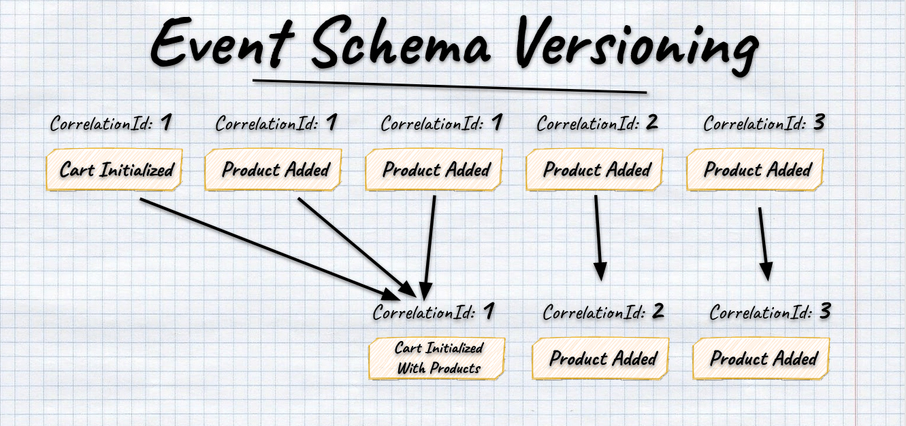
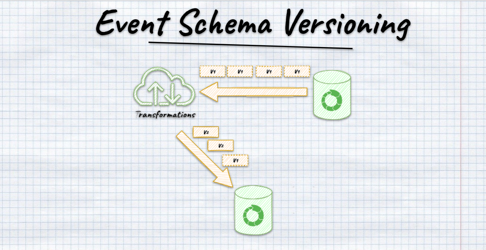

# Event Schema Versioning

- [Event Schema Versioning](#event-schema-versioning)
  - [Simple mapping](#simple-mapping)
    - [New not required property](#new-not-required-property)
    - [New required property](#new-required-property)
    - [Renamed property](#renamed-property)
  - [Upcasting](#upcasting)
    - [Changed Structure](#changed-structure)
    - [New required property](#new-required-property-1)
  - [Downcasters](#downcasters)
  - [Events Transformations](#events-transformations)
  - [Stream Transformation](#stream-transformation)
  - [Migrations](#migrations)
  - [Summary](#summary)

As time flow, the events' definition may change. Our business is changing, and we need to add more information. Sometimes we have to fix a bug or modify the definition for a better developer experience. 

Migrations are never easy, even in relational databases. You always have to think on:
- what caused the change?
- what are the possible solutions?
- is the change breaking?
- what to do with old data?

We should always try to perform the change in a non-breaking manner. I explained that in [Let's take care of ourselves! Thoughts on compatibility](https://event-driven.io/en/lets_take_care_of_ourselves_thoughts_about_comptibility/) article.

The same "issues" happens for event data model. Greg Young wrote a book about it. You can read it for free: https://leanpub.com/esversioning/read. I recommend you to read it.

This sample shows how to do basic Event Schema versioning. Those patterns can be applied to any event store.

You can watch the webinar on YouTube where I'm explaining the details of the implementation:

<a href="https://www.youtube.com/watch?v=fDC465jJoDk" target="_blank"></a>

or read blog article [Simple patterns for events schema versioning](https://event-driven.io/en/simple_events_versioning_patterns/).

## Simple mapping

There are some simple mappings that we could handle on the code structure or serialisation level. I'm using `Jackson` in samples, other serialisers may be smarter, but the patterns will be similar. 

### New not required property

Having event defined as such:

```java
public record ShoppingCartOpened(
    UUID shoppingCartId,
    UUID clientId
  ) { }
```

If we'd like to add a new not required property, e.g. `intializedAt`, we can add it just as a new nullable property. The essential fact to decide if that's the right strategy is if we're good with not having it defined. It can be handled as:

```java
public record ShoppingCartOpened(
    UUID shoppingCartId,
    UUID clientId,
    // Adding new not required property
    LocalDateTime initializedAt
  ) { }
```

Then, most serialisers will put the null value by default and not fail unless we use strict mode. The new events will contain whole information, for the old ones we'll have to live with that.

See full sample: [NewNotRequiredPropertyTests.java](./src/test/java/io/eventdriven/eventsversioning/simplemappings/NewNotRequiredPropertyTests.java).


### New required property

We must define a default value if we'd like to add a new required property and make it non-breaking. It's the same as you'd add a new column to the relational table. 

For instance, we decide that we'd like to add a validation step when the shopping cart is open (e.g. for fraud or spam detection), and our shopping cart can be opened with a pending state. We could solve that by adding the new property with the status information and setting it to `Opened`, assuming that all old events were appended using the older logic.

```java
public enum ShoppingCartStatus {
  Pending,
  Opened,
  Confirmed,
  Cancelled
}

public record ShoppingCartOpened(
  UUID shoppingCartId,
  UUID clientId,
  // Adding new not required property as nullable
  ShoppingCartStatus status
) {
  public ShoppingCartOpened {
    if (status == null) {
      status = ShoppingCartStatus.Opened;
    }
  }
}
```

See full sample: [NewRequiredPropertyTests.java](./src/test/java/io/eventdriven/eventsversioning/simplemappings/NewRequiredPropertyTests.java).

### Renamed property

Renaming property is also a breaking change. Still, we can do it in a non-breaking manner. We could keep the same name in the JSON but map it during (de) serialisation.

Let's assume that we concluded that keeping `ShoppingCart` prefix in the `shoppingCartId` is redundant and decided to change it to `cartId`, as we see in the event name, what cart we have in mind.

We could do it as:

```java
record ShoppingCartOpened(
  @JsonProperty("shoppingCartId") UUID cartId,
  UUID clientId
) implements ShoppingCartEvent {
}
```

The benefit is that both old and the new structure will be backward and forward compatible. The downside of this solution is that we're still keeping the old JSON structure, so all consumers need to be aware of that and do mapping if they want to use the new structure.

See full sample: [NewRequiredPropertyTests.java](./src/test/java/io/eventdriven/eventsversioning/simplemappings/NewRequiredPropertyTests.java).

## Upcasting

Sometimes we want to make more significant changes or be more flexible in the event mapping. We'd like to use a new structure in our code, not polluted by the custom mappings.

We can use an upcasting pattern for that. We can plug a middleware between the deserialisation and application logic. Having that, we can either grab raw JSON or deserialised object of the old structure and transform it to the new schema. 

### Changed Structure

For instance, we decide to send also other information about the client, instead of just their id. We'd like to have a nested object instead of the flattened list of fields. We could model new event structure as:

```java
public record Client(
  UUID id,
  String name
) {
  public Client {
    if (name == null) {
      name = "Unknown";
    }
  }
}

public record ShoppingCartOpened(
  UUID shoppingCartId,
  Client client
) { }
```

We can define upcaster as a function that'll later plug in the deserialisation process. 

We can define the transformation of the object of the old structure as:

```java
public static ShoppingCartOpened upcast(
  ShoppingCartEvent.ShoppingCartOpened oldEvent
  ) {
  return new ShoppingCartOpened(
    oldEvent.shoppingCartId(),
    new Client(oldEvent.clientId(), null)
  );
}
```

Or we can map it from JSON

```java
public static ShoppingCartOpened upcast(
  byte[] oldEventJson
) {
  var oldEvent = Serializer.deserialize(oldEventJson);

  return new ShoppingCartOpened(
    UUID.fromString(oldEvent.at("/shoppingCartId").asText()),
    new Client(
      UUID.fromString(oldEvent.at("/clientId").asText()),
      null
    )
  );
}
```

See full sample: [ChangedStructureTests.java](./src/test/java/io/eventdriven/eventsversioning/upcasters/ChangedStructureTests.java).

### New required property

We can also solve the same cases as simple mappings, but we have more handling options.

Let's say that we forget to add information about who initialised the shopping cart (user id). We cannot retroactively guess what the user was, but if we were lucky enough to track such information in user metadata (e.g. for tracing), we could try to map it.

```java
public record EventMetadata(
  UUID userId
) { }

public record ShoppingCartOpened(
  UUID shoppingCartId,
  UUID clientId,
  UUID initializedBy
) { }
```

Upcaster from old object to the new one can look like:

```java
public static ShoppingCartOpened upcast(
  ShoppingCartEvent.ShoppingCartOpened oldEvent,
  EventMetadata eventMetadata
) {
  return new ShoppingCartOpened(
    oldEvent.shoppingCartId(),
    oldEvent.clientId(),
    eventMetadata.userId()
  );
}
```

From JSON to the object:

```java
public static ShoppingCartOpened upcast(
  byte[] oldEventJson,
  byte[] eventMetadataJson
  ) {
  var oldEvent = Serializer.deserialize(oldEventJson);
  var eventMetadata = Serializer.deserialize(eventMetadataJson);

  return new ShoppingCartOpened(
    UUID.fromString(oldEvent.at("/shoppingCartId").asText()),
    UUID.fromString(oldEvent.at("/clientId").asText()),
    UUID.fromString(eventMetadata.at("/userId").asText())
  );
}
```

See full sample: [NewRequiredPropertyFromMetadataTests.java](./src/test/java/io/eventdriven/eventsversioning/upcasters/NewRequiredPropertyFromMetadataTests.java).

## Downcasters

In the same way, as described above, we can downcast the events from the new structure to the old one (if we have the old reader/listener or, for some reason, want to keep the old format).

From the new object to the old one:

```java
public static ShoppingCartEvent.ShoppingCartOpened downcast(
  ShoppingCartOpened newEvent
) {
  return new ShoppingCartEvent.ShoppingCartOpened(
    newEvent.shoppingCartId(),
    newEvent.client().id()
  );
}
```

From new JSON format to the old object:

```java
public static ShoppingCartEvent.ShoppingCartOpened downcast(
  byte[] newEventJson
) {
  var newEvent = Serializer.deserialize(newEventJson);

  return new ShoppingCartEvent.ShoppingCartOpened(
    UUID.fromString(newEvent.at("/shoppingCartId").asText()),
    UUID.fromString(newEvent.at("/client/id").asText())
  );
}
```

See full sample: [ChangedStructureTests.java](./src/test/java/io/eventdriven/eventsversioning/upcasters/ChangedStructureTests.java).

## Events Transformations

At this point, you may be wondering, "That's nice, but how to connect that with real code?". Let's dive into that.

We'll be plugging between the serialisation and application logic as explained initially. We'll define the class that will contain and process all defined transformations.

```java
public class EventTransformations {
  private final Map<String, Function<byte[], Object>> jsonTransformations = new HashMap<>();

  public Optional<Object> tryTransform(String eventTypeName, byte[] json) {
    if (!jsonTransformations.containsKey(eventTypeName)) {
      return Optional.empty();
    }

    var transformJson = jsonTransformations.get(eventTypeName);

    return Optional.of(transformJson.apply(json));
  }

  public <Event> EventTransformations register(
    String eventTypeName,
    Function<JsonNode, Event> transformJson
  ) {
    jsonTransformations.put(
      eventTypeName,
      json -> transformJson.apply(Serializer.deserialize(json))
    );
    return this;
  }

  public <OldEvent, Event> EventTransformations register(
    Class<OldEvent> oldEventClass,
    String eventTypeName,
    Function<OldEvent, Event> transformEvent
  ) {
    jsonTransformations.put(
      eventTypeName,
      json -> transformEvent.apply(Serializer.deserialize(oldEventClass, json)
        .orElseThrow(() -> new RuntimeException("Error deserializing")))
    );
    return this;
  }
}
```

We have two `register` methods. Both of them has JSON and handler function as params. One is used to register the `JsonNode` raw transformation, the other to register an object to object one. Sample registrations:

```java
var transformations = new EventTransformations()
  .register(eventTypeV1Name, MultipleTransformationsWithDifferentEventTypesTests::upcastV1)
  .register(ShoppingCartOpened.class, eventTypeV2Name, MultipleTransformationsWithDifferentEventTypesTests::upcastV2);
```

We also have `tryTransform` that either transforms JSON into the new object structure or returns `null`. We'll use it further on.

Let's also define the type mapping class responsible for mapping event type name into the CLR type.

```java
public class EventTypeMapping {
  private final Map<String, Class> mappings = new HashMap<>();

  public <Event> EventTypeMapping register(Class<Event> eventClass, String... typeNames) {
    for (var typeName : typeNames) {
      mappings.put(typeName, eventClass);
    }

    return this;
  }

  public Class map(String eventType) {
    return mappings.get(eventType);
  }
}
```

and use it as

```java
final String eventTypeV1Name = "shopping_cart_opened_v1";
final String eventTypeV2Name = "shopping_cart_opened_v2";
final String eventTypeV3Name = "shopping_cart_opened_v3";

var mapping = new EventTypeMapping()
  .register(ShoppingCartInitializedWithStatus.class,
    eventTypeV1Name,
    eventTypeV2Name,
    eventTypeV3Name
  );
```

See details in [EventTypeMapping](./src/test/java/io/eventdriven/eventsversioning/transformations/MultipleTransformationsWithDifferentEventTypesTests.java).

It's the most straightforward wrapper that requires manual mapping for all the event types, but it benefits from being explicit and less error-prone. For the convention-based mapper, there is a risk that refactoring accidentally changes the event type name stored in the event store. Still, a viable option is a mixed solution. See more in [EventTypeMapper in the sample project](../../samples/event-sourcing-esdb-simple/src/main/java/io/eventdriven/ecommerce/core/events/EventTypeMapper.java)

Having those classes, we can define the final deserialisation logic.

```java
public record EventSerializer(
  EventTypeMapping mapping,
  EventTransformations transformations
) {
  public Optional<Object> deserialize(String eventTypeName, byte[] json) {
    return transformations.tryTransform(eventTypeName, json)
      .or(() -> Serializer.deserialize(mapping().map(eventTypeName), json));
  }
}
```

The logic is simple. It'll either transform JSON through registered transformations (e.g. upcasters or downcasters) or run the regular deserialisation logic.

See a full sample in [MultipleTransformationsWithDifferentEventTypesTests.java](src/test/java/io/eventdriven/eventsversioning/transformations/MultipleTransformationsWithDifferentEventTypesTests.java).

## Stream Transformation

You might want not only to transform a single event into another (1:1) but also a set of events into another one (N:M).

Let's take as an example scenario where we can initialise not only empty shopping cart but also filled with products. For some time, we were doing that by publishing multiple events: `ShoppingCartOpened` and `ProductItemAddedToShoppingCart` for each added product item. We decided that we'd like to replace this with event containing list of product items:

```java
public record ProductItem(
  UUID productId,
  int quantity
) {}

public record PricedProductItem(
  ProductItem productItem,
  double unitPrice
) { }

public record ShoppingCartOpened(
  UUID shoppingCartId,
  UUID clientId
) implements ShoppingCartEvent { }

public record ProductItemAddedToShoppingCart(
  UUID shoppingCartId,
  PricedProductItem productItem
) implements ShoppingCartEvent { }

public record ShoppingCartInitializedWithProducts(
  UUID shoppingCartId,
  UUID clientId,
  List<PricedProductItem> productItems
) { }
```

We want to process our logic using a new event schema. However, that'd require zipping multiple stream events into a single one. We were lucky enough that we decided to store in metadata correlation id. It's an identifier of the command that initiated business logic. All of the events resulting from the command processing will share the same correlation id.



Using it, we could decide if `ProductItemAddedToShoppingCart` was a part of the initialisation request or not.

We need to take the stream events and transform them into another sequence of events. It could be modeled by such class:

```java
public class StreamTransformations {
  private final List<Function<List<EventData>, List<EventData>>> jsonTransformations = new ArrayList<>();

  public List<EventData> transform(List<EventData> events) {
    if (jsonTransformations.isEmpty())
      return events;

    var result = events;

    for (var transform : jsonTransformations) {
      result = transform.apply(result);
    }
    return result;
  }

  public StreamTransformations register(Function<List<EventData>, List<EventData>> transformJson) {
    jsonTransformations.add(transformJson);
    return this;
  }
}
```

We allow registering multiple transformations. Thanks to that, we can chain them using the `Aggregate` method, taking the previous transformation's result as a base for the next one.

To connect it with the deserialisation process, we need to add it to the `EventSerializer` defined in the previous steps.

```java
public record EventSerializer(
  EventTypeMapping mapping,
  StreamTransformations streamTransformations,
  EventTransformations transformations
) {
  public Optional<Object> deserialize(String eventTypeName, byte[] json) {
    return transformations.tryTransform(eventTypeName, json)
      .or(() -> Serializer.deserialize(mapping().map(eventTypeName), json));
  }

  public List<Optional<Object>> deserialize(List<EventData> events) {
    return streamTransformations.transform(events).stream()
      .map(event -> deserialize(event.eventType, event.data))
      .toList();
  }
}
```

We're injecting stream transformations into the deserialisation process. We're performing them first before running upcasters or regular deserialisation.

We can implement function doing event grouping as described above as:

```java
public static List<EventData> flattenInitializedEventsWithProductItemsAdded(List<EventData> events) {
  var cartOpened = events.get(0);
  var cartInitializedCorrelationId =
    Serializer.deserialize(EventMetadata.class, cartOpened.metaData)
      .orElseThrow(() -> new RuntimeException("Error deserializing metadata"))
      .correlationId;

  var i = 1;
  var productItemsAdded = new ArrayList<EventData>();

  while (i < events.size()) {
    var eventData = events.get(i);

    if (!eventData.eventType().equals("product_item_added_v1"))
      break;

    var correlationId =
      Serializer.deserialize(EventMetadata.class, eventData.metaData)
        .orElseThrow(() -> new RuntimeException("Error deserializing metadata"))
        .correlationId;

    if (!correlationId.equals(cartInitializedCorrelationId))
      break;

    productItemsAdded.add(eventData);
    i++;
  }

  var mergedEvent = toShoppingCartInitializedWithProducts(
    cartOpened,
    productItemsAdded
  );

  return Stream.concat(
    Stream.of(mergedEvent),
    events.stream().skip(i)
  ).toList();
}

private static EventData toShoppingCartInitializedWithProducts(
  EventData shoppingCartInitialized,
  List<EventData> productItemsAdded
) {
  var shoppingCartInitializedJson =
    Serializer.deserialize(shoppingCartInitialized.data);

  var newEvent = new ShoppingCartInitializedWithProducts(
    UUID.fromString(shoppingCartInitializedJson.at("/shoppingCartId").asText()),
    UUID.fromString(shoppingCartInitializedJson.at("/clientId").asText()),
    productItemsAdded.stream()
      .map(pi -> {
        var pricedProductItem = Serializer.deserialize(pi.data);

        return new PricedProductItem(
          new ProductItem(
            UUID.fromString(pricedProductItem.at("/productItem/productItem/productId").asText()),
            pricedProductItem.at("/productItem/productItem/quantity").asInt()
          ),
          pricedProductItem.at("/productItem/unitPrice").asDouble()
        );
      }).toList()
  );

  return new EventData(
    "shopping_cart_opened_v2",
    Serializer.serialize(newEvent),
    shoppingCartInitialized.metaData
  );
}
```

See a full sample in:
- [StreamTransformationsTests.java](./src/test/java/io/eventdriven/eventsversioning/transformations/StreamTransformationsTests.java).
- [esdb/StreamTransformationsTests.java](./src/test/java/io/eventdriven/eventsversioning/transformations/esdb/StreamTransformationsTests.java) showing how to apply them in practice into EventStoreDB.

## Migrations

You can say that, well, those patterns are not migrations. Events will stay as they were, and you'll have to keep the old structure forever. That's quite true. Still, this is fine, as typically, you should not change the past. Having precise information, even including bugs, is a valid scenario. It allows you to get insights and see the precise history. However, pragmatically you may sometimes want to have a "clean" event log with only a new schema.

It appears that composing the patterns described above can support such a case. For example, if you're running EventStoreDB, you can read/subscribe to the event stream, store events in the new stream, or even a new EventStoreDB cluster. Having that, you could even rewrite the whole log and switch databases once the new one caught up.

I hope that those samples will show you that you can support many versioning scenarios with basic composition techniques.



## Summary

I hope that those samples will show you that you can support many versioning scenarios with basic composition techniques.

Nevertheless, the best approach is to [not need to do versioning at all](https://event-driven.io/en/how_to_do_event_versioning/). If you're facing such a need, before using the strategies described above, make sure that your business scenario cannot be solved by talking to the business. It may appear that's some flaw in the business process modelling. We should not be trying to fix the issue, but the root cause.
