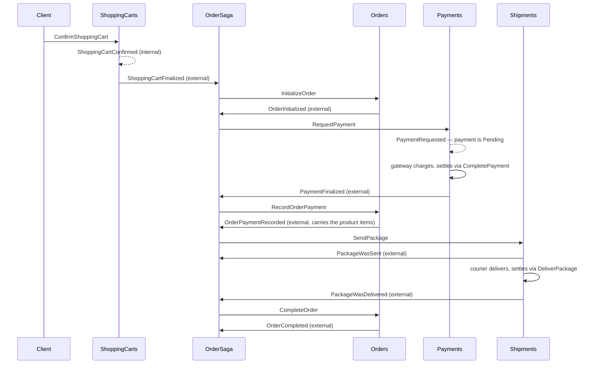
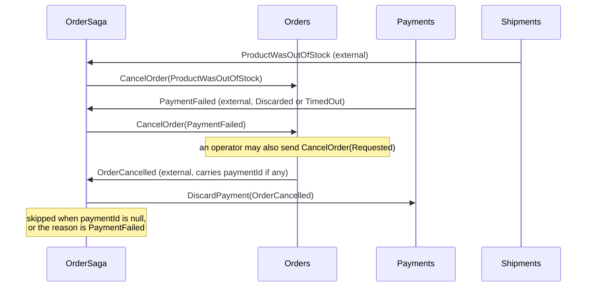

# Spec — Making the ECommerce distributed-processes sample realistic

**Target:** `samples/distributed-processes` (Gradle project `distributed-processes`, Java 22)
**Package under change:** `io.eventdriven.distributedprocesses.ecommerce` plus the `core` seams it needs
**Explicitly out of scope:** `io.eventdriven.distributedprocesses.hotelmanagement` and every `core`
class the order process does not touch

> Revised after reading the code and the introduction-to-event-sourcing workshop. Where an earlier
> draft assumed something the code contradicts, this document now states the corrected version;
> [qa.md](qa.md) records both rounds of decisions and [plan.md](plan.md) turns them into steps.

---

## 1. Why

The ecommerce sample reads like a working distributed process but is inert. `OrderSaga` has eight
`on(event)` methods that schedule commands, yet nothing constructs it, nothing subscribes it to an
event source, and the commands it schedules have no handlers — `OrderService` and `PaymentService`
are empty class bodies. The two `*ExternalEventForwarder` classes have no callers. There is no
composition root and no `EventStoreDBClient` bean.

The result is a sample that shows the *pieces* of a saga but none of the three things that make a
distributed process comprehensible:

1. the **facade** each module exposes, and how a command reaches it;
2. how the saga is actually **called**;
3. how messages are **propagated** across module boundaries.

This spec fills exactly those three gaps, end to end, with tests that prove the process runs.

---

## 2. Design decisions (settled — see `qa.md` for the reasoning)

| # | Decision |
|---|---|
| 1 | Port the workshop shape onto ecommerce: facades, per-module Config composition root, transcript tests. In-memory infrastructure is the runtime. |
| 2 | Keep an explicit **internal vs external** event split per module, bridged by a forwarder. |
| 3 | Three messaging **roles** as separate abstractions — module-internal events, integration events, commands — which the composition root may back with fewer objects than roles. |
| 4 | `OrderSaga` stays an instance with a constructor-injected command bus and `on(event)` methods that send commands directly. |
| 5 | Subscriptions are written **explicitly in Config classes**. |
| 6 | Facades sit over the **existing mutable aggregates**. Facade methods take command records. |
| 7 | Implement **all three failure defences**: failure events, a timeout worker, manual compensation. |
| 8 | **No HTTP layer.** Facades are the entry point. |
| 9 | Unit + integration + E2E tests, **all in-memory**. EventStoreDB stays out of the process tests. |
| 10 | Persistence goes through an **`EventStore` interface** with an in-memory implementation modelled on the introduction-to-event-sourcing workshop. |
| 11 | **Bare messages** on the buses — no envelopes, no correlation metadata. |
| 12 | Fix only the defects that block the order process. |
| 13 | Per-module `*Config` plus one `ECommerceConfig` composing them. |
| 14 | Payments is a **real module**: a payment genuinely sits in `Pending` between request and settlement. |
| 15 | Injected clock; `PaymentTimeoutWorker.run(now)` is called explicitly. No scheduler, no sleeps. |
| 16 | Rewrite the README with a process diagram; keep it tight. |
| 17 | A `PaymentGateway` interface is the settlement seam; test doubles auto-complete, auto-reject, or stay silent. |
| 18 | The saga skips the refund when an order was cancelled *because* its payment failed. |
| 19 | Delivery is implemented: a **delivered** package completes the order, not a sent one. |
| 20 | The in-memory store **publishes on append** — one call persists and dispatches. |
| 21 | It still models optimistic concurrency: expected revisions, conflicts, ETags. |
| 22 | It round-trips events through JSON, as the workshop stores do. |

---

## 3. The process



**Compensation branches**



Note the step the article calls the pragmatic trick: `PaymentFinalized` does not know which
products were bought, so the saga routes through `RecordOrderPayment`; the order's own
`OrderPaymentRecorded` event carries the product items, and its external counterpart passes them on.
That is what keeps the saga stateless.

---

## 4. Target structure

```
core/
  esdb/
    EventStore.java                 interface (was a class): read, append, subscribe, use
    ESDBEventStore.java             the current class body
    InMemoryEventStore.java         NEW — stores AND dispatches on append
  aggregates/
    AggregateStore.java             re-pointed at EventStore; version bug fixed
  messaging/                        NEW package
    CommandBus.java                 interface
    EventBus.java                   interface
    InternalEventBus.java           subscription-only interface, implemented by InMemoryEventStore
    IntegrationEventBus.java        interface extends EventBus
    InMemoryCommandBus.java
    InMemoryEventBus.java

ecommerce/
  ECommerceConfig.java              NEW — the composition root
  shoppingcarts/
    ShoppingCart, ShoppingCartCommand, ShoppingCartEvent     unchanged
    ShoppingCartFacade.java         was ShoppingCartService
    ShoppingCartsConfig.java        NEW
    external/ ShoppingCartFinalized, ShoppingCartExternalEventForwarder
  orders/
    Order.java                      cancel guard + totalPrice fixed
    OrderCommand.java               camelCase; own PricedProductItem; orderId + cartId
    OrderEvent.java                 camelCase on OrderCancelled
    OrderCancellationReason.java    + PaymentFailed, Requested
    OrderFacade.java                was the empty OrderService
    OrderSaga.java                  rewritten
    OrdersConfig.java               NEW
    external/ OrderExternalEvent, OrderExternalEventForwarder            NEW
  payments/
    Payment, PaymentCommand, PaymentEvent                    unchanged
    PaymentFacade.java              was the empty PaymentService
    PaymentGateway.java             NEW — the settlement seam
    PaymentGatewayClient.java       NEW — reacts to PaymentRequested
    PendingPayments.java            NEW — in-module read model
    PaymentTimeoutWorker.java       NEW
    PaymentsConfig.java             NEW
    external/ PaymentExternalEvent, PaymentExternalEventForwarder        exist, get wired
  shipments/
    Shipment.java                   static factory, mapToStreamId, delivery added
    ShipmentCommand.java            camelCase; SendPackage gains shipmentId
    ShipmentEvent.java              + PackageWasDelivered
    ShipmentFacade.java             NEW
    DeliveryProvider.java           NEW — the delivery seam
    DeliveryProviderClient.java     NEW — reacts to PackageWasSent
    PaymentService.java             DELETED (copy-paste artefact)
    ShipmentsConfig.java            NEW
    external/ ShipmentExternalEvent, ShipmentExternalEventForwarder      NEW
```

---

## 5. Core seams

### 5.1 `EventStore`

Extract the current `core/esdb/EventStore` class into an interface. Its result types
(`ReadResult`, `AppendResult`, `DeleteResult`, each a sealed interface) stay — they are what lets an
in-memory implementation model optimistic concurrency honestly.

One correction to an earlier draft: `ReadResult.Success` currently carries `ResolvedEvent[]`, an
EventStoreDB type an in-memory store would have to fabricate. It does not have to — `read()` has
**zero callers** in the project and `ReadResult` is referenced nowhere else, so `Success` changes to
carry `Object[] events`, already deserialized, and `ESDBEventStore` deserializes on the way out.
`AppendResult` keeps its `ExpectedRevision` / `Position` fields, which are constructible in memory
and which the older `CommandBus` / `EventBus` interfaces depend on.

**`InMemoryEventStore` follows the introduction-to-event-sourcing workshop** (see
`workshops/introduction-to-event-sourcing/solved/.../e13_entities_definition/core/EventStore.java`):
appending both persists and publishes. One call, no gap:

```java
public interface EventStore {
  ReadResult read(String streamId);
  AppendResult append(String streamId, Object... events);
  AppendResult append(String streamId, ExpectedRevision expectedRevision, Object... events);
  DeleteResult deleteStream(String streamId);
  AppendResult setStreamMaxAge(String streamId, Duration maxAge);
}
```

`InMemoryEventStore implements EventStore, InternalEventBus`:

- stores `(eventType, json)` envelopes in a `Map<String, List<EventEnvelope>>`, round-tripping
  through the same Jackson configuration the workshop uses. That proves every event is serializable
  and deep-copies stored state, so no test can mutate it through a retained reference;
- honours expected revisions: `noStream()` against an existing stream yields
  `AppendResult.StreamAlreadyExists`; a mismatched revision yields `AppendResult.Conflict(expected,
  actual)`; `any()` always appends; success yields
  `ExpectedRevision.expectedRevision(newRevision)`. Revisions are zero-based;
- after a successful append, dispatches each event to middleware and then to typed subscribers,
  synchronously and depth-first.

### 5.2 `AggregateStore`

Today it takes an `EventStoreDBClient` directly, which is why it cannot run without ESDB. It is
also **never constructed anywhere** — it appears only as a declared field type — so its constructor
and internals are free to change, and the compatibility constructor an earlier draft called for is
unnecessary.

Change the constructor to take `EventStore`, replay through `read`, and fix the version bug: `get`
must set `entity.version` from the stream revision while replaying, so the no-revision
`getAndUpdate` performs real optimistic concurrency instead of always passing `-1`.

Because the store publishes on append, `AggregateStore` gains nothing else: a facade that appends
has already published.

### 5.3 Messaging

A new `core/messaging` package. The existing `core/commands/CommandBus`, `core/events/EventBus` and
their ESDB implementations are **left alone** — `hotelmanagement` depends on them, and rewriting
them is outside the agreed blast radius. The duplication is a deliberate, temporary cost of the
scope boundary; the README names it as a follow-up.

```java
public interface EventBus {
  <Event> void publish(Event... events);
  <Event> EventBus subscribe(Class<Event> type, Consumer<Event> handler);
  EventBus use(Consumer<Object> middleware);
}

public interface CommandBus {
  <Command> void send(Command... commands);
  <Command> CommandBus handle(Class<Command> type, Consumer<Command> handler);
  CommandBus use(Consumer<Object> middleware);
}

public interface InternalEventBus {            // subscription only — publishing is appending
  <Event> InternalEventBus subscribe(Class<Event> type, Consumer<Event> handler);
  InternalEventBus use(Consumer<Object> middleware);
}

public interface IntegrationEventBus extends EventBus { }
```

Three roles, two objects: `InMemoryEventStore` serves the internal channel, `InMemoryEventBus` the
integration one, `InMemoryCommandBus` the commands. That is the shape Q3 asked for — the roles stay
visible in constructor signatures while the implementations coincide where it makes sense.

**Semantics of the in-memory implementations:** synchronous, depth-first dispatch; many handlers per
event type; exactly one handler per command type, with a second registration throwing rather than
silently winning; sending an unhandled command throws; middleware runs before handlers.

---

## 6. Module contracts

Each module owns two vocabularies. **Internal** events are its own business; **external** events and
**accepted commands** are its published contract. Only the saga crosses boundaries, and it may only
reference external events and other modules' commands.

### 6.1 ShoppingCarts

- Accepted commands: `OpenShoppingCart`, `AddProductItemToShoppingCart`,
  `RemoveProductItemFromShoppingCart`, `ConfirmShoppingCart`, `CancelShoppingCart`.
- Internal events: as today.
- External: `ShoppingCartFinalized(cartId, clientId, productItems, totalPrice, finalizedAt)` —
  already exists, carrying `shoppingcarts.productitems.PricedProductItem`.
- Forwarder: on internal `ShoppingCartConfirmed`, re-read the cart and publish
  `ShoppingCartFinalized`. This is the one forwarder that genuinely enriches — `ShoppingCartConfirmed`
  carries only the cart id and a timestamp.

### 6.2 Orders

- Accepted commands: `InitializeOrder(orderId, cartId, clientId, productItems, totalPrice)`,
  `RecordOrderPayment(orderId, paymentId, paymentRecordedAt)`, `CompleteOrder(orderId)`,
  `CancelOrder(orderId, cancellationReason)`.
- Internal events: `OrderInitialized`, `OrderPaymentRecorded`, `OrderCompleted`, `OrderCancelled`.
- External: the same four, as `OrderExternalEvent`. `OrderPaymentRecorded` carries the product items
  — the internal event already does, so this forwarder maps rather than re-reads.
- `OrderCancellationReason` gains `PaymentFailed` and `Requested`.

### 6.3 Payments

- Accepted commands: `RequestPayment`, `CompletePayment`, `DiscardPayment`, `TimeOutPayment`.
- Internal events: `PaymentRequested`, `PaymentCompleted`, `PaymentDiscarded`, `PaymentTimedOut`.
- External: `PaymentFinalized(orderId, paymentId, amount, finalizedAt)` and
  `PaymentFailed(orderId, paymentId, amount, failedAt, Reason)` with `Reason ∈ {Discarded, TimedOut}`
  — both already exist with the right shape.

### 6.4 Shipments

- Accepted commands: `SendPackage(shipmentId, orderId, productItems)`, `DeliverPackage(shipmentId)`.
- Internal events: `PackageWasSent`, `ProductWasOutOfStock`, `PackageWasDelivered`.
- External: the same three, as `ShipmentExternalEvent`. All carry `shipmentId` and `orderId`, so the
  forwarder maps rather than re-reads.

---

## 7. Facades

Every facade method takes exactly one command record, so it binds directly:
`commandBus.handle(InitializeOrder.class, facade::initializeOrder)`. This is the change that makes
the currently-dead command records load-bearing (`ShoppingCartService` takes unpacked arguments
today).

Because the store publishes on append, a facade **does not publish**. It loads, decides, and
appends; subscribers hear about it because appending is publishing.

```java
public class OrderFacade {
  private final AggregateStore<Order, OrderEvent, UUID> store;
  private final Supplier<OffsetDateTime> now;

  public void initializeOrder(InitializeOrder command) {
    store.add(Order.initialize(command.orderId(), command.cartId(), command.clientId(),
                               command.productItems(), command.totalPrice(), now.get()));
  }

  public void recordOrderPayment(RecordOrderPayment command) { /* getAndUpdate */ }
  public void completeOrder(CompleteOrder command)           { /* ... */ }
  public void cancelOrder(CancelOrder command)               { /* ... */ }
}
```

Rules that apply to every facade:

- a command handler must not throw for a **business** failure. Business failures are events
  (`ProductWasOutOfStock`, `PaymentDiscarded`). See §9.1;
- nothing reads the clock directly — time arrives as `Supplier<OffsetDateTime>`.

---

## 8. The saga

`OrderSaga` keeps its constructor-injected `CommandBus` and its `on(event)` methods. It imports only
external events and other modules' command records. It holds no state, and mints new ids through an
injected `Supplier<UUID>` so transcripts are deterministic.

```java
public class OrderSaga {
  // happy path
  on(ShoppingCartFinalized)                  -> InitializeOrder(newId, cartId, clientId, items, total)
  on(OrderExternalEvent.OrderInitialized)    -> RequestPayment(newId, orderId, totalPrice)
  on(PaymentExternalEvent.PaymentFinalized)  -> RecordOrderPayment(orderId, paymentId, finalizedAt)
  on(OrderExternalEvent.OrderPaymentRecorded)-> SendPackage(newId, orderId, productItems)
  on(ShipmentExternalEvent.PackageWasDelivered) -> CompleteOrder(orderId)

  // compensation
  on(ShipmentExternalEvent.ProductWasOutOfStock) -> CancelOrder(orderId, ProductWasOutOfStock)
  on(PaymentExternalEvent.PaymentFailed)         -> CancelOrder(orderId, PaymentFailed)
  on(OrderExternalEvent.OrderCancelled)          -> DiscardPayment(paymentId, OrderCancelled)
                                                    unless paymentId is null,
                                                    or the reason is PaymentFailed
}
```

The order completes on **delivery**, not on dispatch. `PackageWasSent` is still published and still
appears in the transcript; the saga simply does not act on it.

The refund guard matters: when an order was cancelled *because* its payment failed, there is nothing
to refund, and `Payment.discard` would throw on an already-failed payment. One line in the saga
keeps that correct without giving the saga state.

Three product-item types meet in this class — the cart's `PricedProductItem` (a nested `ProductItem`
plus a unit price), the order's flat `PricedProductItem`, and the shipment's `ProductItem`. The
mapping belongs in the saga, not in the modules.

---

## 9. The three failure defences

### 9.1 Failure events instead of exceptions

- Shipments: `Shipment` already takes `Function<ProductItem, Boolean> isProductAvailable` and
  produces `ProductWasOutOfStock` rather than throwing. Keep that shape.
- Payments: `PaymentGatewayClient` calls the gateway inside a try/catch and sends
  `DiscardPayment(UnexpectedError)` on any exception rather than letting it escape. A command
  handler that throws freezes the process.

### 9.2 Settlement seams

Neither a card charge nor a courier delivery happens inside a command handler. Both sit behind an
interface, called by a small client that reacts to the module's own internal event:

```java
public interface PaymentGateway  { void charge(UUID paymentId, double amount); }
public interface DeliveryProvider { void deliver(UUID shipmentId, ProductItem[] productItems); }
```

`PaymentGatewayClient` subscribes to `PaymentRequested` and calls `charge`. `DeliveryProviderClient`
subscribes to `PackageWasSent` and calls `deliver`. In production these would call a provider and
the answer would arrive later as a webhook; in the sample the implementation settles by sending
`CompletePayment` / `DiscardPayment` or `DeliverPackage` back on the command bus. Test doubles:
auto-complete, auto-reject, and silent — the silent one is what gives the timeout worker something
to catch.

### 9.3 Timeout worker

`PendingPayments` is a tiny in-module read model subscribed to the payments store: it records
`(paymentId, requestedAt)` on `PaymentRequested` and removes the entry on `PaymentCompleted` /
`PaymentDiscarded` / `PaymentTimedOut`.

```java
public class PaymentTimeoutWorker {
  public void run(OffsetDateTime now) {
    pendingPayments.olderThan(now.minus(timeout))
      .forEach(id -> commandBus.send(new TimeOutPayment(id, now)));
  }
}
```

Production would call `run` on a schedule; tests call it directly with a chosen instant.
`TimeOutPayment` → `PaymentTimedOut` → external `PaymentFailed(TimedOut)` → `CancelOrder`.

### 9.4 Manual compensation

An operator cancels a stuck order by sending `CancelOrder(orderId, Requested)` on the command bus —
no special code path. The resulting external `OrderCancelled` carries the `paymentId` when one
exists, so the refund goes through the same `DiscardPayment` step as every other compensation.

---

## 10. Composition root

Each module Config registers the commands it accepts, its own forwarder, and any client or read
model that belongs to it. It receives the channels it needs and nothing else.

```java
public final class OrdersConfig {
  public static OrderFacade configure(
    CommandBus commandBus,
    InternalEventBus internalEvents,        // the store's own subscriptions
    IntegrationEventBus integrationEvents,
    EventStore eventStore,
    Supplier<OffsetDateTime> now
  ) {
    var store     = new AggregateStore<>(eventStore, Order::mapToStreamId, Order::new);
    var facade    = new OrderFacade(store, now);
    var forwarder = new OrderExternalEventForwarder(integrationEvents);

    commandBus
      .handle(InitializeOrder.class,    facade::initializeOrder)
      .handle(RecordOrderPayment.class, facade::recordOrderPayment)
      .handle(CompleteOrder.class,      facade::completeOrder)
      .handle(CancelOrder.class,        facade::cancelOrder);

    internalEvents
      .subscribe(OrderEvent.OrderInitialized.class,     forwarder::on)
      .subscribe(OrderEvent.OrderPaymentRecorded.class, forwarder::on)
      .subscribe(OrderEvent.OrderCompleted.class,       forwarder::on)
      .subscribe(OrderEvent.OrderCancelled.class,       forwarder::on);

    return facade;
  }
}
```

`ECommerceConfig` builds the store and the two buses, calls the four module Configs, and owns the
saga subscriptions — the one place where modules are knitted together:

```java
var eventStore  = new InMemoryEventStore();   // internal channel: appending is publishing
var integration = new InMemoryEventBus();     // cross-module channel
var commandBus  = new InMemoryCommandBus();

// ...four module Configs...

var saga = new OrderSaga(commandBus, newId);

integration
  .subscribe(ShoppingCartFinalized.class,                    saga::on)
  .subscribe(OrderExternalEvent.OrderInitialized.class,      saga::on)
  .subscribe(PaymentExternalEvent.PaymentFinalized.class,    saga::on)
  .subscribe(OrderExternalEvent.OrderPaymentRecorded.class,  saga::on)
  .subscribe(ShipmentExternalEvent.PackageWasDelivered.class, saga::on)

  .subscribe(ShipmentExternalEvent.ProductWasOutOfStock.class, saga::on)
  .subscribe(PaymentExternalEvent.PaymentFailed.class,        saga::on)
  .subscribe(OrderExternalEvent.OrderCancelled.class,         saga::on);
```

Reading those eight lines is reading the whole process. That is the point of the exercise.

---

## 11. Defects to fix

| # | File | Problem | Fix |
|---|---|---|---|
| 1 | `orders/Order.java` | `cancel` throws when status is `Opened` or `Cancelled`, so a freshly opened order can never be cancelled — the compensation path is dead | Throw only for `Completed` and `Cancelled` |
| 2 | `orders/Order.java` | `when(OrderInitialized)` never assigns `totalPrice`, so the field stays `0` and `OrderPaymentRecorded.amount` is always `0` | Assign it |
| 3 | `shipments/PaymentService.java` | Empty class copy-pasted into the wrong module | Delete |
| 4 | `core/aggregates/AggregateStore.java` | `get` replays without setting `version`, so the no-revision `getAndUpdate` always passes `-1` | Set `version` from the stream revision during replay |
| 5 | `orders/OrderCommand.java` | `InitializeOrder` carries `shoppingcarts.productitems.PricedProductItem` while `OrderEvent` uses the orders type, with no mapping | Use the orders type; the saga maps |
| 6 | `orders/OrderCommand.java`, `OrderEvent.OrderCancelled` | Record components are PascalCase (`UUID OrderId`, `OrderCancellationReason Reason`) | camelCase |
| 7 | `shipments/ShipmentCommand.java` | PascalCase components, and `SendPackage` carries no `shipmentId` | camelCase; add `shipmentId` |
| 8 | `shipments/Shipment.java` | Logic lives in a public constructor; no static factory, no `mapToStreamId` | Add `send(...)` and `mapToStreamId`; make the constructor private |
| 9 | `shipments/Shipment.java` | `when` never assigns `orderId`, though both events carry it | Assign it |

`Order`, `Payment` and `Shipment` also lack `mapToStreamId` entirely — only `ShoppingCart` has one.

---

## 12. Tests

TDD throughout: write the failing test, make it pass, refactor. Test output must be clean.

### 12.1 Unit — aggregates

`ShoppingCart`, `Order`, `Payment` and `Shipment`, Given/When/Then over events. A correction to an
earlier draft: the existing `io.eventdriven.testing.EventSourcedSpecification` is **decider-shaped**
(`Supplier<Entity>` plus a `BiFunction evolve`, with `when` as a `Function<Entity, Event[]>`) and
cannot drive a mutable `AbstractAggregate`; `hotelmanagement`'s tests depend on its current shape.
Add a sibling `AggregateSpecification` instead.

Must include `Order.cancel` from `Opened` (the regression test for defect 1), `OrderPaymentRecorded`
carrying a non-zero amount (defect 2), and `Shipment` with an unavailable product.

### 12.2 Unit — saga

`OrderSaga` with a recording command bus: one test per `on(...)` method asserting the command sent,
plus the two cases where it sends nothing — a null `paymentId`, and a cancellation caused by
`PaymentFailed`.

### 12.3 Integration — facade, store and forwarder per module

One class per module: send a command on the command bus, assert the state stored and the internal
events dispatched, and assert the external event the forwarder published.

### 12.4 E2E — the process

`OrderProcessTests`, built on `ECommerceConfig` with `InMemoryEventStore`, a fixed clock, a
deterministic id supplier, and a `MessageCatcher` registered as middleware on both the integration
bus and the command bus. Each test asserts the **full interleaved transcript**.

Scenarios:

1. **Happy path** — confirm a cart, with an auto-completing gateway and an auto-delivering provider;
   assert the complete transcript through `OrderCompleted`.
2. **Out of stock** — assert `CancelOrder(ProductWasOutOfStock)` then `DiscardPayment`.
3. **Payment rejected** — auto-rejecting gateway; assert `PaymentFailed(Discarded)` →
   `CancelOrder(PaymentFailed)` and that **no** `DiscardPayment` follows.
4. **Payment timeout** — silent gateway, then `worker.run(now.plus(timeout).plusSeconds(1))`; assert
   `PaymentTimedOut` → `PaymentFailed(TimedOut)` → `CancelOrder`, and that a second `run` sends
   nothing.
5. **Manual compensation** — operator sends `CancelOrder(Requested)` mid-process; assert the refund
   follows.
6. **Order with no payment yet** — cancel before the payment settles; assert no `DiscardPayment`.

A `MessageCatcher` equivalent is needed in this project; put it under
`src/test/java/io/eventdriven/testing`.

---

## 13. Build, CI, docs

- No new production dependencies. Jackson is already present for the in-memory store's envelopes;
  AssertJ comes with `spring-boot-starter-test`.
- No Testcontainers, no `spring-boot-starter-web`.
- CI keeps working unchanged: the process tests need no running infrastructure, and the existing
  ESDB-dependent `ShoppingCartTests` is untouched.
- README rewrite: the process and module ownership, both mermaid diagrams, why a forwarder exists,
  where the saga is wired, and the three failure defences. Link the article ("What can go wrong with
  distributed systems? Everything!"). No file-by-file walkthrough, no .NET sample link. Fix the
  drifted `send` / `schedule` naming. Note the `core/messaging` vs `core/commands` duplication as a
  known follow-up.

---

## 14. Delivery plan

Each phase ends with `./gradlew build` green — compile, linter, and every test. No phase starts
before the previous one is green. [plan.md](plan.md) holds the step-by-step prompts.

**Phase 0 — core seams. Sequential.**
`EventStore` interface; `ESDBEventStore`; `InMemoryEventStore` that stores, dispatches and honours
revisions; `AggregateStore` re-pointed with the version fix; `core/messaging`; the
`AggregateSpecification` and `MessageCatcher` test helpers.

**Phase 1 — the four modules. Four parallel tracks.**
Per module: normalise the command records, write the facade, define the external contract, write the
forwarder and any settlement client, write the Config. Each track delivers its own tests and is
green on its own. Tracks touch disjoint packages; the only shared code is `core`, frozen by Phase 0.

**Phase 2 — wire the process. Sequential, after all four tracks.**
Rewrite `OrderSaga`, write `ECommerceConfig`, add the saga unit tests and the happy-path transcript.

**Phase 3 — failure paths. Three parallel tracks, merged one at a time.**
Out-of-stock and payment-rejected; timeout; manual compensation and the unpaid-order case.

**Phase 4 — documentation. Sequential, last.**

---

## 15. Assumptions to confirm at review

1. `DeliveryProvider` mirrors `PaymentGateway` as the delivery seam. Implementing delivery was
   agreed; putting it behind an interface with a client reacting to `PackageWasSent` is an inference
   from the payments decision, chosen for symmetry.
2. `core/messaging` is added alongside the existing `core/commands` / `core/events` rather than
   replacing them, because `hotelmanagement` depends on the old interfaces and is out of scope.
3. `InternalEventBus` is a subscription-only interface implemented by `InMemoryEventStore`, so the
   three channel roles stay visible in constructor signatures while being served by two objects.
