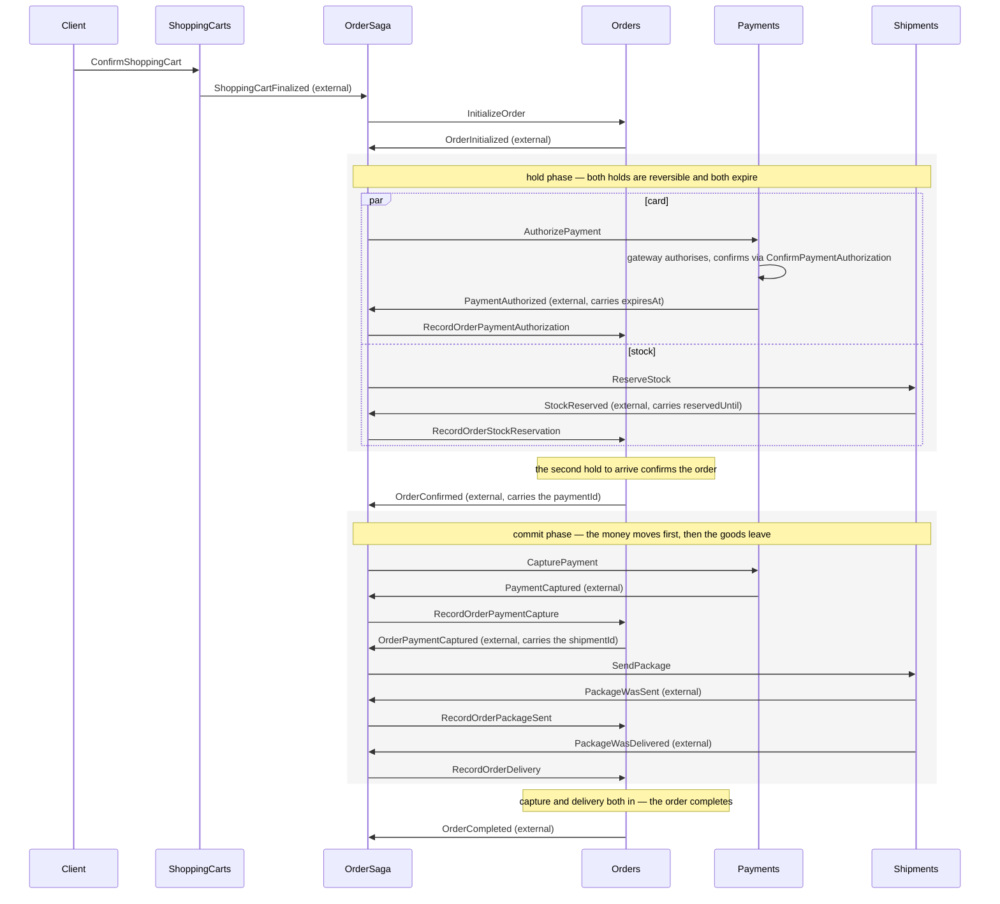
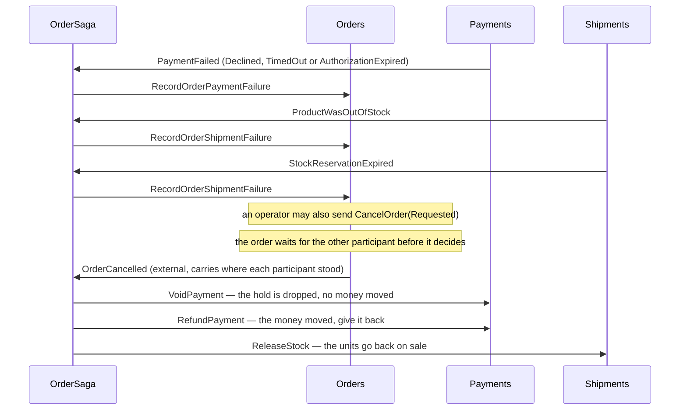

# Spec — Making the ECommerce distributed-processes sample realistic

**Target:** `samples/distributed-processes` (Gradle project `distributed-processes`, Java 22)
**Package under change:** `io.eventdriven.distributedprocesses.ecommerce` plus the `core` seams it needs
**Explicitly out of scope:** `io.eventdriven.distributedprocesses.hotelmanagement` and every `core`
class the order process does not touch

> Revised after reading the code and the introduction-to-event-sourcing workshop. Where an earlier
> draft assumed something the code contradicts, this document now states the corrected version;
> [qa.md](qa.md) records both rounds of decisions and [plan.md](plan.md) turns them into steps.

---

## 1. Why

The ecommerce sample reads like a working distributed process but is inert. `OrderSaga` has eight
`on(event)` methods that schedule commands, yet nothing constructs it, nothing subscribes it to an
event source, and the commands it schedules have no handlers — `OrderService` and `PaymentService`
are empty class bodies. The two `*ExternalEventForwarder` classes have no callers. There is no
composition root and no `EventStoreDBClient` bean.

The result is a sample that shows the *pieces* of a saga but none of the three things that make a
distributed process comprehensible:

1. the **facade** each module exposes, and how a command reaches it;
2. how the saga is actually **called**;
3. how messages are **propagated** across module boundaries.

This spec fills exactly those three gaps, end to end, with tests that prove the process runs.

---

## 2. Design decisions (settled — see `qa.md` for the reasoning)

| # | Decision |
|---|---|
| 1 | Port the workshop shape onto ecommerce: facades, per-module Config composition root, transcript tests. In-memory infrastructure is the runtime. |
| 2 | Keep an explicit **internal vs external** event split per module, bridged by a forwarder. |
| 3 | Three messaging **roles** as separate abstractions — module-internal events, integration events, commands — which the composition root may back with fewer objects than roles. |
| 4 | `OrderSaga` stays an instance with a constructor-injected command bus and `on(event)` methods that send commands directly. |
| 5 | Subscriptions are written **explicitly in Config classes**. |
| 6 | Facades sit over the **existing mutable aggregates**. Facade methods take command records. |
| 7 | Implement **all three failure defences**: failure events, a timeout worker, manual compensation. |
| 8 | **No HTTP layer.** Facades are the entry point. |
| 9 | Unit + integration + E2E tests, **all in-memory**. EventStoreDB stays out of the process tests. |
| 10 | Persistence goes through an **`EventStore` interface** with an in-memory implementation modelled on the introduction-to-event-sourcing workshop. |
| 11 | **Bare messages** on the buses — no envelopes, no correlation metadata. |
| 12 | Fix only the defects that block the order process. |
| 13 | Per-module `*Config` plus one `ECommerceConfig` composing them. |
| 14 | Payments is a **real module**: a payment genuinely sits in `Pending` between request and settlement. |
| 15 | Injected clock; `PaymentTimeoutWorker.run(now)` is called explicitly. No scheduler, no sleeps. |
| 16 | Rewrite the README with a process diagram; keep it tight. |
| 17 | A `PaymentGateway` interface is the settlement seam; test doubles auto-complete, auto-reject, or stay silent. |
| 18 | The saga skips the refund when an order was cancelled *because* its payment failed. |
| 19 | Delivery is implemented: a **delivered** package completes the order, not a sent one. |
| 20 | The in-memory store **publishes on append** — one call persists and dispatches. |
| 21 | It still models optimistic concurrency: expected revisions, conflicts, ETags. |
| 22 | It round-trips events through JSON, as the workshop stores do. |

---

## 3. The process

Nothing is bought in one step. The order takes two **reversible holds** — an authorisation on the
card and a reservation in the warehouse — waits for both, and only then commits: the parcel goes
out, and the funds are captured as it leaves.



**Compensation branches**



### 3.1 The order decides, the saga only translates

`Order` holds one state per participant, exactly as `GroupCheckout` holds one `CheckoutStatus` per
guest stay:

| Participant | States |
|---|---|
| payment | `Pending` → `Authorized` → `Captured`, or `Failed` |
| shipment | `Pending` → `Reserved` → `Sent` → `Delivered`, or `Failed` |

Every step is recorded as its own event. The record that completes a phase appends a second event in
the same batch:

- both holds in → `OrderConfirmed`
- captured **and** delivered → `OrderCompleted`
- one participant failed and the other is no longer pending → `OrderCancelled`

There is no `CompleteOrder` command and no `ConfirmOrder` command. Nobody outside the order decides
that the order moved on.

**Why it waits for both before cancelling.** A failed payment does not cancel on its own. The order
first needs to know where the shipment stands, because that decides what must be undone: released
stock, nothing, or neither. Waiting is what makes the process safe when two modules answer at once —
`RecordOrderPaymentAuthorization` then `RecordOrderStockReservation` and the reverse produce the same
state.

**The order carries the data the saga lacks.** `PaymentCaptured` does not know which shipment is
waiting on it — the payments module has never heard of a shipment. So the saga routes through the
order: it records the capture, and the order republishes it as `OrderPaymentCaptured` **with the
`shipmentId`**, which is what lets the next command be `SendPackage`. This is the article's
pragmatic trick, and it is what keeps the saga stateless.

**Nothing ships before the money moves.** `recordPackageSent` acts only when the payment is already
`Captured`, so a dispatch that somehow arrives early appends nothing and returns.

**The order also decides the compensation.** `OrderCancelled` carries where each participant stood
when the order gave up:

| `paymentState` | saga sends |
|---|---|
| `NotAuthorized` | nothing — no hold exists |
| `Authorized` | `VoidPayment` |
| `Captured` | `RefundPayment` |

| `shipmentState` | saga sends |
|---|---|
| `NotReserved` | nothing |
| `Reserved` | `ReleaseStock` |
| `Sent` | nothing — see the residual risk below |

The saga does not work any of this out. It reads a state and sends the matching command.

### 3.2 Both holds expire, so a lost message cannot strand the order

A hold that only ends through compensation is a hold that leaks. If the release message is lost, or
the order never gets to send it, the units stay unsellable and the customer's funds stay blocked.
Real systems avoid this by giving every hold a deadline:

| Hold | Deadline on the event | Freed by | Expiry event |
|---|---|---|---|
| card authorisation | `expiresAt` | `AuthorizationExpiryWorker` | `PaymentAuthorizationExpired` |
| stock reservation | `reservedUntil` | `ReservationExpiryWorker` | `StockReservationExpired` |

Stripe states that an online card authorisation is "usually valid for 7 days", and that if it
expires before the capture, "the funds are released and the payment status changes to `canceled`" —
which is exactly the rule this sample implements. Adyen documents the window per scheme, and it
varies widely: Mastercard 7 days for a final authorisation and 30 for a pre-authorisation, Visa 5 to
30 depending on the merchant category, JCB up to a year. Merchants delay the capture until dispatch
on purpose. Shopify calls the warehouse side **committed** — "units that are set aside and can't be
sold, such as units in an unfulfilled order" — and a WMS calls the step **allocation**.

- Stripe, [Place a hold on a payment method](https://docs.stripe.com/payments/place-a-hold-on-a-payment-method)
- Adyen, [Adjust authorisation](https://docs.adyen.com/online-payments/adjust-authorisation) and [Capture](https://docs.adyen.com/online-payments/capture)
- Shopify, [Inventory states](https://help.shopify.com/en/manual/products/inventory/managing-inventory-quantities/inventory-states)

**The order subscribes to both expiries.** This is the point: the order is never left hanging. A
reservation that runs out reaches it as `RecordOrderShipmentFailure`, an authorisation that runs out
reaches it as `RecordOrderPaymentFailure`, and in both cases the order decides and cancels. Nothing
waits forever for a message that is not coming.

Both workers mirror `PaymentTimeoutWorker`, which already existed for a gateway that never answers.
Each keeps an in-memory registry fed by the module's own internal events, and each is called with an
explicit `now` so tests stay deterministic.

### 3.3 No aggregate throws at a message it cannot use

A message handler that throws in an asynchronous process blocks that process. So in the three
modules driven by messages — orders, payments and shipments — a command that arrives too late, or
twice, appends nothing and returns:

```java
public void recordPaymentAuthorization(PaymentId paymentId, OffsetDateTime authorizedAt) {
  if (payment != PaymentState.Pending || status != Status.Opened)
    return;
  ...
}
```

`GroupCheckoutDecider` does the same, returning an empty event array. No event means no change, so
`getAndUpdate` appends nothing and the stream version stays put.

`ShoppingCart` still throws. Its commands come from a person over HTTP, where a rejected action must
reach the caller as an error, not vanish.

### 3.4 The words for undoing a payment

`DiscardPayment` named no real operation. Gateways separate three, and which one applies depends only
on whether the money moved yet:

| Operation | State | Effect |
|---|---|---|
| **Void** (Stripe and Adyen say *cancel*, card networks say *authorisation reversal*) | authorised, not captured | the hold drops, no money ever moves, no fee |
| **Refund** | captured | settled funds travel back, acquirer to issuer |
| **Chargeback** | captured | the *issuer* forces it back, on the customer's word, with a fee |

A chargeback is never ours to send. It is a dispute the customer starts against us, so the name is
out. `DiscardReason` also hid two unrelated things, which are now two commands:

| Old | New | Allowed when |
|---|---|---|
| `DiscardPayment(paymentId, UnexpectedError)` | `DeclinePayment(paymentId, reason)` | the authorisation is Pending |
| `DiscardPayment(paymentId, OrderCancelled)` | `VoidPayment(paymentId)` | Authorized — nothing moved yet |
| — | `RefundPayment(paymentId)` | Captured |

That split fixed a live defect: `Payment.discard` acted only while the payment was `Pending`, but the
saga's reversal always arrives later, so it never ran.

### 3.5 What the sample still does not do

**Capture cannot fail here.** Only the authorisation makes a gateway round-trip, because that is the
step a real gateway declines. Capture, void and refund are recorded and then handed to the gateway by
a client that does not answer back. A capture that fails on a valid authorisation is rare, and
modelling three more callbacks would repeat a lesson the authorisation already teaches.

**A sent package has no return path.** Nothing ships before the capture, so an order cancelled after
dispatch is rare — it needs an operator. When it happens the saga refunds the money and records
`shipmentState = Sent`, but nothing recalls the parcel. Returns are a process of their own.

**Partial reservations do not exist.** A reservation covers every line or none. Real shops split
shipments; that is a different sample.

---

## 4. Target structure

```
core/
  esdb/
    EventStore.java                 interface (was a class): read, append, subscribe, use
    ESDBEventStore.java             the current class body
    InMemoryEventStore.java         NEW — stores AND dispatches on append
  aggregates/
    AggregateStore.java             re-pointed at EventStore; version bug fixed
  messaging/                        NEW package
    CommandBus.java                 interface
    EventBus.java                   interface
    InternalEventBus.java           subscription-only interface, implemented by InMemoryEventStore
    IntegrationEventBus.java        interface extends EventBus
    InMemoryCommandBus.java
    InMemoryEventBus.java

ecommerce/
  ECommerceConfig.java              NEW — the composition root
  shoppingcarts/
    ShoppingCart, ShoppingCartCommand, ShoppingCartEvent     unchanged
    ShoppingCartFacade.java         was ShoppingCartService
    ShoppingCartsConfig.java        NEW
    external/ ShoppingCartFinalized, ShoppingCartExternalEventForwarder
  orders/
    Order.java                      cancel guard + totalPrice fixed
    OrderCommand.java               camelCase; own PricedProductItem; orderId + cartId
    OrderEvent.java                 camelCase on OrderCancelled
    OrderCancellationReason.java    + PaymentFailed, Requested
    OrderFacade.java                was the empty OrderService
    OrderSaga.java                  rewritten
    OrdersConfig.java               NEW
    external/ OrderExternalEvent, OrderExternalEventForwarder            NEW
  payments/
    Payment, PaymentCommand, PaymentEvent                    unchanged
    PaymentFacade.java              was the empty PaymentService
    PaymentGateway.java             NEW — the settlement seam
    PaymentGatewayClient.java       NEW — reacts to PaymentRequested
    PendingPayments.java            NEW — in-module read model
    PaymentTimeoutWorker.java       NEW
    PaymentsConfig.java             NEW
    external/ PaymentExternalEvent, PaymentExternalEventForwarder        exist, get wired
  shipments/
    Shipment.java                   static factory, mapToStreamId, delivery added
    ShipmentCommand.java            camelCase; SendPackage gains shipmentId
    ShipmentEvent.java              + PackageWasDelivered
    ShipmentFacade.java             NEW
    DeliveryProvider.java           NEW — the delivery seam
    DeliveryProviderClient.java     NEW — reacts to PackageWasSent
    PaymentService.java             DELETED (copy-paste artefact)
    ShipmentsConfig.java            NEW
    external/ ShipmentExternalEvent, ShipmentExternalEventForwarder      NEW
```

---

## 5. Core seams

### 5.1 `EventStore`

Extract the current `core/esdb/EventStore` class into an interface, narrowed to what this sample
actually uses: reading and appending. Its result types (`ReadResult`, `AppendResult`, `DeleteResult`,
each a sealed interface) stay — they are what lets an in-memory implementation model optimistic
concurrency honestly.

`deleteStream` (both overloads) and `setStreamMaxAge` are **not** on the interface. They have zero
callers anywhere in the sample, and putting them on an interface would force every implementation to
answer a question nothing asks — the in-memory one could only throw. They stay as ordinary methods on
`ESDBEventStore`, where they already were; `DeleteResult` stays nested in `EventStore` because they
still return it.

One correction to an earlier draft: `ReadResult.Success` currently carries `ResolvedEvent[]`, an
EventStoreDB type an in-memory store would have to fabricate. It does not have to — `read()` has
**zero callers** in the project and `ReadResult` is referenced nowhere else, so `Success` changes to
carry `Object[] events`, already deserialized, and `ESDBEventStore` deserializes on the way out.
`AppendResult` keeps its `ExpectedRevision` / `Position` fields, which are constructible in memory
and which the older `CommandBus` / `EventBus` interfaces depend on.

**`InMemoryEventStore` follows the introduction-to-event-sourcing workshop** (see
`workshops/introduction-to-event-sourcing/solved/.../e13_entities_definition/core/EventStore.java`):
appending both persists and publishes. One call, no gap:

```java
public interface EventStore {
  ReadResult read(String streamId);
  AppendResult append(String streamId, Object... events);
  AppendResult append(String streamId, ExpectedRevision expectedRevision, Object... events);
}
```

`InMemoryEventStore implements EventStore, InternalEventBus`:

- stores `(eventType, json)` envelopes in a `Map<String, List<EventEnvelope>>`, round-tripping
  through the same Jackson configuration the workshop uses. That proves every event is serializable
  and deep-copies stored state, so no test can mutate it through a retained reference;
- honours expected revisions: `noStream()` against an existing stream yields
  `AppendResult.StreamAlreadyExists`; a mismatched revision yields `AppendResult.Conflict(expected,
  actual)`; `any()` always appends; success yields
  `ExpectedRevision.expectedRevision(newRevision)`. Revisions are zero-based;
- after a successful append, dispatches each event to middleware and then to typed subscribers,
  synchronously and depth-first.

### 5.2 `AggregateStore`

Today it takes an `EventStoreDBClient` directly, which is why it cannot run without ESDB. It is
also **never constructed anywhere** — it appears only as a declared field type — so its constructor
and internals are free to change, and the compatibility constructor an earlier draft called for is
unnecessary.

Change the constructor to take `EventStore`, replay through `read`, and fix the version bug: `get`
must set `entity.version` from the stream revision while replaying, so the no-revision
`getAndUpdate` performs real optimistic concurrency instead of always passing `-1`.

Because the store publishes on append, `AggregateStore` gains nothing else: a facade that appends
has already published.

`AggregateStore` exposes **one path** for every command, matching the workshop's
`Database.Collection.getAndUpdate`:

```java
public ETag getAndUpdate(Id id, Consumer<Entity> handle)
public ETag getAndUpdate(Id id, long expectedVersion, Consumer<Entity> handle)
```

It reads the entity or starts from the empty one, applies the command, and appends. Version `-1`
maps to `ExpectedRevision.noStream()`, so creating and updating are the same code. There is no `add`
and no `addIfAbsent`.

Two responsibilities are separated, and this is the point of the design:

| Concern | Where it lives |
|---|---|
| Idempotency — the same message arrives twice | **the aggregate**, which enqueues nothing the second time |
| Optimistic concurrency — someone else wrote in between | **the store**, which fails on a version mismatch |

**If there is no event, there is no change.** When the handler enqueues nothing, the store does not
append and the revision does not move. That is what makes a redelivered command harmless, and it is
a property of the domain rule, not of a special store method.

The second overload takes the caller's expected version, which is what the shopping cart's
`expectedVersion` commands use. A mismatch throws.

`Conflict` throws everywhere. A conflict is a concurrent write to a stream that was expected to
exist, which is a different problem and must stay loud.

Because creation is now a method on the empty entity, every aggregate's factory becomes an instance
method with a guard: `ShoppingCart.open`, `Order.initialize`, `Payment.request`, `Shipment.send`.
`hotelmanagement`'s `GuestStayAccount.open` follows, because it shares this store.

### 5.3 Derived, strongly typed identifiers

The saga must not call `UUID.randomUUID()`. It must not take a `Supplier<UUID>` either. A supplier
gives a new identifier at each call, so a redelivered message starts a second payment.

Each identifier is derived from the identifier that caused it:

| Identifier | Derived from | Rule |
|---|---|---|
| `OrderId` | `ShoppingCartId` | A client confirms a cart one time. |
| `PaymentId` | `OrderId` | An order has one payment. |
| `ShipmentId` | `OrderId` | An order has one shipment. |

A derived identifier is an idempotency key that nobody stores. A redelivered message gives the same
identifier, so it reaches the same aggregate, which then enqueues nothing. No inbox table, no
deduplication store, no saga state.

An identifier is a **readable URN**, not a UUID:

```
urn:<namespace>:<type>:<tail>

urn:ecommerce:cart:9f2a3b7c-…
urn:ecommerce:order:9f2a3b7c-…
urn:ecommerce:payment:9f2a3b7c-…
urn:ecommerce:shipment:9f2a3b7c-…
```

The tail is the same through the whole process. Deriving joins a new type to the existing tail.
There is no hash, no lookup and no table. A hash would be equally stable but opaque: a reader of a
transcript could not see that a payment belongs to an order.

Identifiers are **strongly typed**, one record per aggregate, in that aggregate's own package:

```java
public record OrderId(@JsonValue String value) implements EntityId {
  private static final String type = "order";

  @JsonCreator(mode = JsonCreator.Mode.DELEGATING)
  public OrderId {
    Urns.requireType(value, type);
  }

  public static OrderId of(UUID id) { ... }
  public static OrderId derivedFrom(String sourceUrn) { ... }
}
```

The compact constructor is the guarantee: an `OrderId` cannot hold `urn:ecommerce:payment:…`, and
the check runs on deserialization too, because `@JsonCreator` is on that same constructor.

`core/identifiers/Urns` is a **static helper**, not a type — it joins, splits and validates the
format. `EntityId` is a one-method interface supplying `tail()`. Wrapping a `Urn` value type inside
each id was rejected: once each id validates its own format, the inner type carries no meaning.

`@JsonValue` on the record component keeps stored events flat — `"orderId":"urn:ecommerce:order:…"`,
not `{"value":…}`. This is verified by `OrderIdSerializationTests`, which must stay: Jackson changed
this behaviour between 2.17 and 2.18, so the project pins 2.18.2 and the test guards the next bump.
No extra dependency is used; `jmolecules-jackson` would remove the two annotations but is out of
scope.

`clientId` and `productId` stay `UUID`. Nothing derives them and they come from outside the process.

`mapToStreamId` maps an id to `<Entity>-<tail>`, because EventStoreDB splits a stream name on the
first `-` to build the `$ce-` category, and a raw URN would give a category of
`urn:ecommerce:order:9f2a3b7c`.

### 5.3.1 The open host boundary

`Payment` and `Shipment` are **generic subdomains**. In production you buy Stripe and EasyPost. They
publish a language many consumers use, so they must not name any one consumer's concepts.

Neither holds an `orderId`. Both hold an opaque `String referenceId`, exactly as
[Adyen's `merchantReference`](https://docs.adyen.com/api-explorer/Checkout/latest/post/payments),
Stripe's `metadata` and EasyPost's `reference` do. They store it and echo it back. They never parse
it.

A gateway call is **asymmetric**, and we match that:

| Direction | Adyen | Stripe | Ours |
|---|---|---|---|
| Request | `merchantReference` | `client_reference_id` / `metadata` | `referenceId` |
| Notification | `pspReference` **and** `merchantReference` | `id` **and** `client_reference_id` | `paymentId` **and** `referenceId` |

So the caller never names the payment. `RequestPayment(referenceId, amount)` and
`SendPackage(referenceId, productItems)` carry the reference only. The module assigns its own
identifier:

```java
public void requestPayment(RequestPayment command) {
  var paymentId = PaymentId.derivedFrom(command.referenceId());
  store.getAndUpdate(paymentId, current -> current.request(
    paymentId, command.referenceId(), command.amount()));
}
```

Deriving instead of minting keeps the idempotency without a lookup: the same reference always
reaches the same stream, and the aggregate's create guard drops the second request. The published
events then carry both values, like a webhook.

`OrderSaga` is the only translator. It writes `orderId.value()` into `referenceId` and reads it back
as `new OrderId(event.referenceId())`, which validates the segment. A cart URN arriving there fails
loudly, in the one place allowed to know. The saga names no `PaymentId` and no `ShipmentId` at all.

**Accepted limit:** `paymentId = f(orderId)` permits exactly one payment per order. If the process
ever retried a failed payment, the retry would derive the same identifier and the aggregate's create
guard would drop it. This process does not retry payments. A production system folds an attempt
number into the derivation; the sample states this rather than implements it.

### 5.4 Messaging

A new `core/messaging` package. The existing `core/commands/CommandBus`, `core/events/EventBus` and
their ESDB implementations are **left alone** — `hotelmanagement` depends on them, and rewriting
them is outside the agreed blast radius. The duplication is a deliberate, temporary cost of the
scope boundary; the README names it as a follow-up.

```java
public interface EventBus {
  <Event> void publish(Event... events);
  <Event> EventBus subscribe(Class<Event> type, Consumer<Event> handler);
  EventBus use(Consumer<Object> middleware);
}

public interface CommandBus {
  <Command> void send(Command... commands);
  <Command> CommandBus handle(Class<Command> type, Consumer<Command> handler);
  CommandBus use(Consumer<Object> middleware);
}

public interface InternalEventBus {            // subscription only — publishing is appending
  <Event> InternalEventBus subscribe(Class<Event> type, Consumer<Event> handler);
  InternalEventBus use(Consumer<Object> middleware);
}

public interface IntegrationEventBus extends EventBus { }
```

Three roles, two objects: `InMemoryEventStore` serves the internal channel, `InMemoryEventBus` the
integration one, `InMemoryCommandBus` the commands. That is the shape Q3 asked for — the roles stay
visible in constructor signatures while the implementations coincide where it makes sense.

**Semantics of the in-memory implementations:** synchronous, depth-first dispatch; many handlers per
event type; exactly one handler per command type, with a second registration throwing rather than
silently winning; sending an unhandled command throws; middleware runs before handlers.

---

## 6. Module contracts

Each module owns two vocabularies. **Internal** events are its own business; **external** events and
**accepted commands** are its published contract. Only the saga crosses boundaries, and it may only
reference external events and other modules' commands.

### 6.1 ShoppingCarts

- Accepted commands: `OpenShoppingCart`, `AddProductItemToShoppingCart`,
  `RemoveProductItemFromShoppingCart`, `ConfirmShoppingCart`, `CancelShoppingCart`.
- Internal events: as today.
- External: `ShoppingCartFinalized(cartId, clientId, productItems, totalPrice, finalizedAt)` —
  already exists, carrying `shoppingcarts.productitems.PricedProductItem`.
- Forwarder: on internal `ShoppingCartConfirmed`, re-read the cart and publish
  `ShoppingCartFinalized`. This is the one forwarder that genuinely enriches — `ShoppingCartConfirmed`
  carries only the cart id and a timestamp.

### 6.2 Orders

- Accepted commands: `InitializeOrder(orderId, cartId, clientId, productItems, totalPrice)`,
  `RecordOrderPaymentAuthorization`, `RecordOrderStockReservation`, `RecordOrderPackageSent`,
  `RecordOrderPaymentCapture`, `RecordOrderDelivery`, `RecordOrderPaymentFailure`,
  `RecordOrderShipmentFailure`, `CancelOrder(orderId, cancellationReason)`.
- Internal events: `OrderInitialized`, `OrderPaymentAuthorized`, `OrderStockReserved`,
  `OrderConfirmed`, `OrderPackageSent`, `OrderPaymentCaptured`, `OrderShipmentDelivered`,
  `OrderCompleted`, `OrderPaymentFailed`, `OrderShipmentFailed`, `OrderCancelled`.
- External: `OrderInitialized`, `OrderConfirmed`, `OrderPaymentCaptured`, `OrderCompleted` and
  `OrderCancelled`. Those five are the ones the saga acts on. `OrderConfirmed` carries the
  `paymentId`, `OrderPaymentCaptured` carries the `shipmentId`, and `OrderCancelled` carries
  `paymentState` and `shipmentState` — see §3.1.
- `OrderCancellationReason` holds `ProductWasOutOfStock`, `PaymentFailed` and `Requested`.

### 6.3 Payments

- Accepted commands: `AuthorizePayment(referenceId, amount)`,
  `ConfirmPaymentAuthorization(paymentId)`, `CapturePayment(paymentId)`, `VoidPayment(paymentId)`,
  `RefundPayment(paymentId)`, `DeclinePayment(paymentId, reason)`, `TimeOutPayment(paymentId, at)`,
  `ExpirePaymentAuthorization(paymentId, at)`.
- Internal events: `PaymentAuthorizationRequested`, `PaymentAuthorized`, `PaymentCaptured`,
  `PaymentVoided`, `PaymentRefunded`, `PaymentDeclined`, `PaymentTimedOut`,
  `PaymentAuthorizationExpired`.
- External: `PaymentAuthorized(referenceId, paymentId, amount, authorizedAt, expiresAt)`,
  `PaymentCaptured(referenceId, paymentId, amount, capturedAt)` and
  `PaymentFailed(referenceId, paymentId, amount, failedAt, Reason)` with
  `Reason ∈ {Declined, TimedOut, AuthorizationExpired}`. A void and a refund publish nothing —
  nothing consumes them. See §3.4 for the vocabulary.

### 6.4 Shipments

- Accepted commands: `ReserveStock(referenceId, productItems)`, `SendPackage(shipmentId)`,
  `DeliverPackage(shipmentId)`, `ReleaseStock(shipmentId)`,
  `ExpireStockReservation(shipmentId, at)`.
- Internal events: `StockReserved`, `ProductWasOutOfStock`, `PackageWasSent`, `PackageWasDelivered`,
  `StockReleased`, `StockReservationExpired`.
- External: `StockReserved(shipmentId, referenceId, reservedAt, reservedUntil)`,
  `ProductWasOutOfStock`, `PackageWasSent`, `PackageWasDelivered` and `StockReservationExpired`.
  A release publishes nothing — it is the end of a compensation nobody waits on. All carry
  `shipmentId` and `referenceId`, so the forwarder maps rather than re-reads.

---

## 7. Facades

Every facade method takes exactly one command record, so it binds directly:
`commandBus.handle(InitializeOrder.class, facade::initializeOrder)`. This is the change that makes
the currently-dead command records load-bearing (`ShoppingCartService` takes unpacked arguments
today).

Because the store publishes on append, a facade **does not publish**. It loads, decides, and
appends; subscribers hear about it because appending is publishing.

```java
public class OrderFacade {
  private final AggregateStore<Order, OrderEvent, UUID> store;
  private final Supplier<OffsetDateTime> now;

  public void initializeOrder(InitializeOrder command) {
    store.add(Order.initialize(command.orderId(), command.cartId(), command.clientId(),
                               command.productItems(), command.totalPrice(), now.get()));
  }

  public void recordOrderPayment(RecordOrderPayment command) { /* getAndUpdate */ }
  public void completeOrder(CompleteOrder command)           { /* ... */ }
  public void cancelOrder(CancelOrder command)               { /* ... */ }
}
```

Rules that apply to every facade:

- a command handler must not throw for a **business** failure. Business failures are events
  (`ProductWasOutOfStock`, `PaymentDeclined`). See §9.1;
- nothing reads the clock directly — time arrives as `Supplier<OffsetDateTime>`.

---

## 8. The saga

`OrderSaga` keeps its constructor-injected `CommandBus` and its `on(event)` methods. It imports only
external events and other modules' command records. It holds no state and takes no id supplier. It
derives every new identifier from the identifier that caused it (§5.3), so the saga is a pure
function of the incoming event.

```java
public class OrderSaga {
  // hold phase
  on(ShoppingCartFinalized)            -> InitializeOrder(orderId(cartId), cartId, clientId,
                                                          items, total)
  on(Order.OrderInitialized)           -> AuthorizePayment(referenceId, total)
                                          ReserveStock(referenceId, items)
  on(Payment.PaymentAuthorized)        -> RecordOrderPaymentAuthorization(orderId, paymentId, at)
  on(Shipment.StockReserved)           -> RecordOrderStockReservation(orderId, shipmentId, at)

  // commit phase
  on(Order.OrderConfirmed)             -> CapturePayment(paymentId)
  on(Payment.PaymentCaptured)          -> RecordOrderPaymentCapture(orderId, capturedAt)
  on(Order.OrderPaymentCaptured)       -> SendPackage(shipmentId)
  on(Shipment.PackageWasSent)          -> RecordOrderPackageSent(orderId, sentAt)
  on(Shipment.PackageWasDelivered)     -> RecordOrderDelivery(orderId, deliveredAt)

  // compensation
  on(Payment.PaymentFailed)            -> RecordOrderPaymentFailure(orderId, failedAt)
  on(Shipment.ProductWasOutOfStock)    -> RecordOrderShipmentFailure(orderId, at)
  on(Shipment.StockReservationExpired) -> RecordOrderShipmentFailure(orderId, expiredAt)
  on(Order.OrderCancelled)             -> VoidPayment | RefundPayment  by paymentState
                                          ReleaseStock                 when shipmentState = Reserved
}
```

Two handlers exist only because the saga cannot know what it is not told. `PaymentCaptured` does not
carry the shipment, so the saga records the capture and acts on the order's answer,
`OrderPaymentCaptured`, which does. `StockReserved` does not carry the order's other half either,
which is why the join lives in the order and not here.

The order completes on **delivery**, and nothing leaves the warehouse before the capture.

Three product-item types meet in this class — the cart's `PricedProductItem` (a nested `ProductItem`
plus a unit price), the order's flat `PricedProductItem`, and the shipment's `ProductItem`. The
mapping belongs in the saga, not in the modules.

---

## 9. The three failure defences

### 9.1 Failure events instead of exceptions

- Shipments: `Shipment` already takes `Function<ProductItem, Boolean> isProductAvailable` and
  produces `ProductWasOutOfStock` rather than throwing. Keep that shape.
- Payments: `PaymentGatewayClient` calls the gateway inside a try/catch and sends
  `DeclinePayment(UnexpectedError)` on any exception rather than letting it escape. A command
  handler that throws freezes the process.

### 9.2 Settlement seams

Neither a card authorisation nor a courier delivery happens inside a command handler. Both sit behind
an interface, called by a small client that reacts to the module's own internal event:

```java
public interface PaymentGateway {
  void authorize(PaymentId paymentId, double amount);
  void capture(PaymentId paymentId);
  void voidAuthorization(PaymentId paymentId);
  void refund(PaymentId paymentId);
}

public interface DeliveryProvider { void deliver(ShipmentId shipmentId, ProductItem[] items); }
```

`PaymentGatewayClient` subscribes to `PaymentAuthorizationRequested` and calls `authorize`; the
provider answers later with `ConfirmPaymentAuthorization` or `DeclinePayment`. It also subscribes to
`PaymentCaptured`, `PaymentVoided` and `PaymentRefunded` and tells the gateway what the module has
already recorded — see §3.5 for why only the authorisation answers back.

`DeliveryProviderClient` subscribes to `PackageWasSent` and calls `deliver`; the courier answers with
`DeliverPackage`. Test doubles: auto-authorising, auto-rejecting, and silent — the silent one is what
gives the timeout worker something to catch.

### 9.3 Three workers, one shape

Nothing in the process may wait forever. Three small in-module read models watch a deadline, and
three workers act on it:

| Worker | Registry | Watches | Sends |
|---|---|---|---|
| `PaymentTimeoutWorker` | `PendingPayments` | a gateway that never answers | `TimeOutPayment` |
| `AuthorizationExpiryWorker` | `AuthorizedPayments` | `expiresAt` on the hold | `ExpirePaymentAuthorization` |
| `ReservationExpiryWorker` | `StockReservations` | `reservedUntil` on the hold | `ExpireStockReservation` |

```java
public class ReservationExpiryWorker {
  public void run(OffsetDateTime now) {
    stockReservations.expiredAt(now)
      .forEach(id -> commandBus.send(new ExpireStockReservation(id, now)));
  }
}
```

Production would call `run` on a schedule; tests call it directly with a chosen instant. The first
watches a request, the other two watch a hold, and each registry is fed by its module's own internal
events. Every one of them ends at the order: `PaymentFailed` or `StockReservationExpired` reaches the
saga, which records the failure, and the order decides.

### 9.4 Manual compensation

An operator cancels a stuck order by sending `CancelOrder(orderId, Requested)` on the command bus —
no special code path. The resulting external `OrderCancelled` carries where each participant stood,
so the money and the goods are released through the same commands as every other compensation.

---

## 10. Composition root

Each module Config registers the commands it accepts, its own forwarder, and any client or read
model that belongs to it. It receives the channels it needs and nothing else.

```java
public final class OrdersConfig {
  public static OrderFacade configure(
    CommandBus commandBus,
    InternalEventBus internalEvents,        // the store's own subscriptions
    IntegrationEventBus integrationEvents,
    EventStore eventStore,
    Supplier<OffsetDateTime> now
  ) {
    var store     = new AggregateStore<>(eventStore, OrderFacade::mapToStreamId, Order::empty);
    var facade    = new OrderFacade(store, now);
    var forwarder = new OrderExternalEventForwarder(integrationEvents);

    commandBus
      .handle(InitializeOrder.class,                  facade::initializeOrder)
      .handle(RecordOrderPaymentAuthorization.class,  facade::recordOrderPaymentAuthorization)
      .handle(RecordOrderStockReservation.class,      facade::recordOrderStockReservation)
      .handle(RecordOrderPackageSent.class,           facade::recordOrderPackageSent)
      .handle(RecordOrderPaymentCapture.class,        facade::recordOrderPaymentCapture)
      .handle(RecordOrderDelivery.class,              facade::recordOrderDelivery)
      .handle(RecordOrderPaymentFailure.class,        facade::recordOrderPaymentFailure)
      .handle(RecordOrderShipmentFailure.class,       facade::recordOrderShipmentFailure)
      .handle(CancelOrder.class,                      facade::cancelOrder);

    internalEvents
      .subscribe(OrderEvent.OrderInitialized.class,  forwarder::on)
      .subscribe(OrderEvent.OrderConfirmed.class,    forwarder::on)
      .subscribe(OrderEvent.OrderPackageSent.class,  forwarder::on)
      .subscribe(OrderEvent.OrderCompleted.class,    forwarder::on)
      .subscribe(OrderEvent.OrderCancelled.class,    forwarder::on);

    return facade;
  }
}
```

`ECommerceConfig` builds the store and the two buses, calls the four module Configs, and owns the
saga subscriptions — the one place where modules are knitted together:

```java
var eventStore  = new InMemoryEventStore();   // internal channel: appending is publishing
var integration = new InMemoryEventBus();     // cross-module channel
var commandBus  = new InMemoryCommandBus();

// ...four module Configs...

var saga = new OrderSaga(commandBus);

integration
  // hold phase
  .subscribe(ShoppingCartFinalized.class,                       saga::on)
  .subscribe(OrderExternalEvent.OrderInitialized.class,         saga::on)
  .subscribe(PaymentExternalEvent.PaymentAuthorized.class,      saga::on)
  .subscribe(ShipmentExternalEvent.StockReserved.class,         saga::on)

  // commit phase
  .subscribe(OrderExternalEvent.OrderConfirmed.class,           saga::on)
  .subscribe(PaymentExternalEvent.PaymentCaptured.class,        saga::on)
  .subscribe(OrderExternalEvent.OrderPaymentCaptured.class,     saga::on)
  .subscribe(ShipmentExternalEvent.PackageWasSent.class,        saga::on)
  .subscribe(ShipmentExternalEvent.PackageWasDelivered.class,   saga::on)

  // compensation — manual compensation enters through the same command bus
  .subscribe(PaymentExternalEvent.PaymentFailed.class,            saga::on)
  .subscribe(ShipmentExternalEvent.ProductWasOutOfStock.class,    saga::on)
  .subscribe(ShipmentExternalEvent.StockReservationExpired.class, saga::on)
  .subscribe(OrderExternalEvent.OrderCancelled.class,             saga::on);
```

Reading those thirteen lines is reading the whole process. That is the point of the exercise.

---

## 11. Defects to fix

| # | File | Problem | Fix |
|---|---|---|---|
| 1 | `orders/Order.java` | `cancel` throws when status is `Opened` or `Cancelled`, so a freshly opened order can never be cancelled — the compensation path is dead | Throw only for `Completed` and `Cancelled` |
| 2 | `orders/Order.java` | `when(OrderInitialized)` never assigns `totalPrice`, so the field stays `0` and `OrderPaymentRecorded.amount` is always `0` | Assign it |
| 3 | `shipments/PaymentService.java` | Empty class copy-pasted into the wrong module | Delete |
| 4 | `core/aggregates/AggregateStore.java` | `get` replays without setting `version`, so the no-revision `getAndUpdate` always passes `-1` | Set `version` from the stream revision during replay |
| 5 | `orders/OrderCommand.java` | `InitializeOrder` carries `shoppingcarts.productitems.PricedProductItem` while `OrderEvent` uses the orders type, with no mapping | Use the orders type; the saga maps |
| 6 | `orders/OrderCommand.java`, `OrderEvent.OrderCancelled` | Record components are PascalCase (`UUID OrderId`, `OrderCancellationReason Reason`) | camelCase |
| 7 | `shipments/ShipmentCommand.java` | PascalCase components, and `SendPackage` carries no `shipmentId` | camelCase; add `shipmentId` |
| 8 | `shipments/Shipment.java` | Logic lives in a public constructor; no static factory, no `mapToStreamId` | Add `send(...)` and `mapToStreamId`; make the constructor private |
| 9 | `shipments/Shipment.java` | `when` never assigns `orderId`, though both events carry it | Assign it |

`Order`, `Payment` and `Shipment` also lack `mapToStreamId` entirely — only `ShoppingCart` has one.

---

## 12. Tests

TDD throughout: write the failing test, make it pass, refactor. Test output must be clean.

### 12.1 Unit — aggregates

`ShoppingCart`, `Order`, `Payment` and `Shipment`, Given/When/Then over events. A correction to an
earlier draft: the existing `io.eventdriven.testing.EventSourcedSpecification` is **decider-shaped**
(`Supplier<Entity>` plus a `BiFunction evolve`, with `when` as a `Function<Entity, Event[]>`) and
cannot drive a mutable `AbstractAggregate`; `hotelmanagement`'s tests depend on its current shape.
Add a sibling `AggregateSpecification` instead.

Must include `Order.cancel` from `Opened` (the regression test for defect 1), `OrderPaymentRecorded`
carrying a non-zero amount (defect 2), and `Shipment` with an unavailable product.

### 12.2 Unit — saga

`OrderSaga` with a recording command bus: one test per `on(...)` method asserting the command sent,
plus the two cases where it sends nothing — a null `paymentId`, and a cancellation caused by
`PaymentFailed`.

### 12.3 Integration — facade, store and forwarder per module

One class per module: send a command on the command bus, assert the state stored and the internal
events dispatched, and assert the external event the forwarder published.

### 12.4 E2E — the process

`OrderProcessTests`, built on `ECommerceConfig` with `InMemoryEventStore`, a fixed clock, a
deterministic id supplier, and a `MessageCatcher` registered as middleware on both the integration
bus and the command bus. Each test asserts the **full interleaved transcript**.

Scenarios:

1. **Happy path** — confirm a cart, with an auto-completing gateway and an auto-delivering provider;
   assert the complete transcript through `OrderCompleted`.
2. **Out of stock** — assert `RecordOrderShipmentFailure` then `RefundPayment`.
3. **Payment rejected** — auto-rejecting gateway; assert `PaymentFailed(Declined)` →
   `RecordOrderPaymentFailure` and that **no** `RefundPayment` follows.
4. **Payment timeout** — silent gateway, then `worker.run(now.plus(timeout).plusSeconds(1))`; assert
   `PaymentTimedOut` → `PaymentFailed(TimedOut)` → `CancelOrder`, and that a second `run` sends
   nothing.
5. **Manual compensation** — operator sends `CancelOrder(Requested)` mid-process; assert the refund
   follows.
6. **Order with no payment yet** — cancel before the payment settles; assert no `RefundPayment`.

A `MessageCatcher` equivalent is needed in this project; put it under
`src/test/java/io/eventdriven/testing`.

---

## 13. Build, CI, docs

- No new production dependencies. Jackson is already present for the in-memory store's envelopes;
  AssertJ comes with `spring-boot-starter-test`.
- No Testcontainers, no `spring-boot-starter-web`.
- CI keeps working unchanged: the process tests need no running infrastructure, and the existing
  ESDB-dependent `ShoppingCartTests` is untouched.
- README rewrite: the process and module ownership, both mermaid diagrams, why a forwarder exists,
  where the saga is wired, and the three failure defences. Link the article ("What can go wrong with
  distributed systems? Everything!"). No file-by-file walkthrough, no .NET sample link. Fix the
  drifted `send` / `schedule` naming. Note the `core/messaging` vs `core/commands` duplication as a
  known follow-up.

---

## 14. Delivery plan

Each phase ends with `./gradlew build` green — compile, linter, and every test. No phase starts
before the previous one is green. [plan.md](plan.md) holds the step-by-step prompts.

**Phase 0 — core seams. Sequential.**
`EventStore` interface; `ESDBEventStore`; `InMemoryEventStore` that stores, dispatches and honours
revisions; `AggregateStore` re-pointed with the version fix; `core/messaging`; the
`AggregateSpecification` and `MessageCatcher` test helpers.

**Phase 1 — the four modules. Four parallel tracks.**
Per module: normalise the command records, write the facade, define the external contract, write the
forwarder and any settlement client, write the Config. Each track delivers its own tests and is
green on its own. Tracks touch disjoint packages; the only shared code is `core`, frozen by Phase 0.

**Phase 2 — wire the process. Sequential, after all four tracks.**
Rewrite `OrderSaga`, write `ECommerceConfig`, add the saga unit tests and the happy-path transcript.

**Phase 3 — failure paths. Three parallel tracks, merged one at a time.**
Out-of-stock and payment-rejected; timeout; manual compensation and the unpaid-order case.

**Phase 4 — documentation. Sequential, last.**

---

## 15. Assumptions to confirm at review

1. `DeliveryProvider` mirrors `PaymentGateway` as the delivery seam. Implementing delivery was
   agreed; putting it behind an interface with a client reacting to `PackageWasSent` is an inference
   from the payments decision, chosen for symmetry.
2. `core/messaging` is added alongside the existing `core/commands` / `core/events` rather than
   replacing them, because `hotelmanagement` depends on the old interfaces and is out of scope.
3. `InternalEventBus` is a subscription-only interface implemented by `InMemoryEventStore`, so the
   three channel roles stay visible in constructor signatures while being served by two objects.
